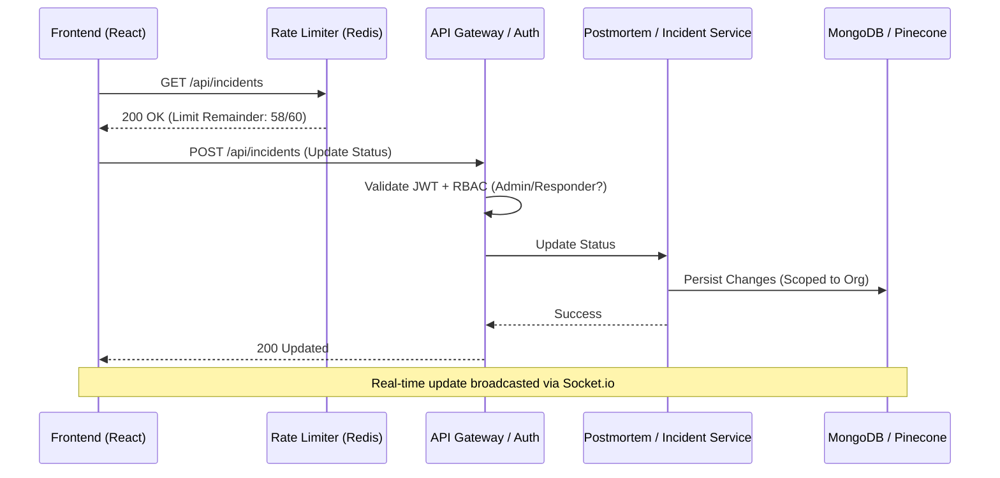

# Frontend-Backend Integration & Security Usage Report

**Project:** AlertForge  
**Auditor:** Senior Full-Stack Security Architect  
**Date:** May 3, 2026

---

## 1. SYSTEM OVERVIEW

### Backend Architecture
The backend is built on a **Layered Service-Controller-DAO** architecture with a focus on multi-tenant isolation and security hardening. 
- **Authentication:** Dual-tier system using `smartAuth`. Handles browser-based JWT (HttpOnly Cookies) and SDK-based API Keys (`x-api-key`).
- **Security Baseline:** Every request passes through a centralized Rate Limiter (Redis-backed) and Organization Isolation layer.
- **Real-time:** Socket.io cluster using Redis adapter, authenticated via API Key handshakes.

### Security Layers Present
1. **Rate Limiting:** Tiered limits for Public (60/min), Auth (5/min - *CRITICAL*), and Heavy (10/min) operations.
2. **RBAC:** Multi-role enforcement (`admin`, `responder`, `viewer`) with database-level role verification per request.
3. **Multi-Tenancy:** All data access is strictly scoped to `organizationId` resolved during authentication.
4. **War Room Scoping:** Incident-specific JWTs for secure "joining" of real-time war rooms.

---

## 2. FEATURE USAGE MATRIX

| Backend Feature | Backend Status | Frontend Usage | Issue / Gap |
| :--- | :--- | :--- | :--- |
| **Custom Auth (JWT)** | Fully Hardened | Implemented | **Conflict:** Frontend still wraps with Clerk, leading to session confusion. |
| **Refresh Tokens** | Cookie-based | Partial | Interceptor exists but lacks concurrent request queuing (race conditions). |
| **Rate Limiting** | Implemented | **Not Used** | Frontend crashes on 429; no retry logic or exponential backoff. |
| **RBAC Enforcement** | Database-level | **Partial** | UI shows buttons (Invite, Resolve) to unauthorized roles. |
| **Socket API Key Auth** | Handshake-level | Implemented | Relies on manual key entry; should use stored system keys. |
| **Organization Isolation** | DAO-level | Passive | Frontend doesn't handle multi-org switching or scoped views. |
| **War Room Joining** | Token-based | **Bypassed** | Frontend skips the secure token join flow (`/warroom/:id/join`). |
| **Uptime Calculation** | Rolling Logic | Passive | Frontend shows static percentages; lacks historical data fetching. |

---

## 3. CRITICAL INTEGRATION GAPS

### ❌ Auth Mismatch (High Risk)
The frontend is currently in a "Hybrid State." It initializes `ClerkProvider` in `main.jsx` and uses Clerk hooks in the Sidebar, while calling a custom Express backend for API data. 
*   **Risk:** Users might be logged into Clerk but not AlertForge, or vice versa.
*   **Fix:** Remove Clerk dependencies and unify under the `AuthContext` + `apiClient` flow.

### ❌ Rate Limit Ignorance
The backend has a very strict `Auth` limit (5 requests/min).
*   **Issue:** The frontend dashboard triggers multiple parallel requests on load (Incidents, Team, Services). This **will** trigger a 429 error.
*   **Fix:** Implement a 429 interceptor with "Retry-After" support.

### ❌ Socket Recovery
The current socket service (`socket.js`) has a static `reconnectionAttempts: 5`.
*   **Issue:** In production environments, a 5-second downtime will permanently kill the live feed.
*   **Fix:** Use exponential backoff and persistent reconnection.

---

## 4. HOW FRONTEND SHOULD USE BACKEND FEATURES

### 1. Handling 429 (Rate Limit)
When the backend returns `429 Too Many Requests`, the frontend MUST:
- Read the `Retry-After` header (if present).
- Disable the "Submit" or "Refresh" buttons for that duration.
- Show a toast notification: *"Slow down! You've hit the rate limit. Please wait X seconds."*

### 2. Enforcing RBAC in UI
The `user` object from `AuthContext` contains the `role`.
- **Admin only:** Show Team Management, Integration Settings.
- **Responder+:** Show "Resolve", "Edit Postmortem", "Create Incident".
- **Viewer:** Read-only dashboard.

### 3. Secure War Room Flow
The current direct socket join is insecure. The flow MUST be:
1.  User clicks "Join War Room".
2.  Frontend calls `GET /api/warroom/:incidentId/join`.
3.  Backend returns a short-lived **WarRoom Access Token**.
4.  Frontend initializes Socket with this token in the handshake.

---

## 5. SECURITY BEST PRACTICES

1.  **Exponential Backoff:** If an API call fails due to network or rate limit, retry after 1s, 2s, 4s, etc.
2.  **Token Refresh Strategy:** Ensure the `apiClient` interceptor queues requests while a refresh is in progress to prevent "Token Churn."
3.  **No Direct Key Entry:** Remove the manual API Key input from the War Room UI. Fetch the key from the user's profile settings automatically.

---

## 6. FINAL ARCHITECTURE FLOW

---

**Report Conclusion:** The backend is significantly more hardened than the frontend currently supports. Immediate action is required to unify the Auth system and implement rate-limit handling to prevent production outages.
