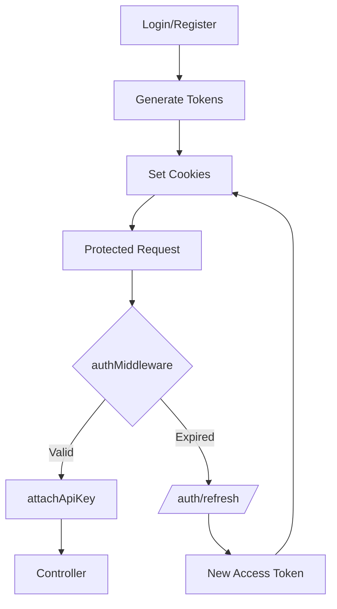

# 🔐 Authentication & Middleware Flow

## 🧠 Overview

The AlertForge authentication system is a robust, security-first implementation designed to protect sensitive incident data while providing a seamless developer experience. It utilizes a **dual-token JWT strategy** (Access + Refresh) combined with **HttpOnly cookies** to eliminate common web vulnerabilities like XSS and CSRF. Every request to a protected resource undergoes a multi-stage validation process that not only verifies the user's identity but also automatically attaches their active service-level API credentials.

---

## 🔐 Authentication System

The system relies on two types of JSON Web Tokens (JWT) to manage session state:

| Token Type              | Lifespan   | Purpose                                                                     | Storage                            |
| :---------------------- | :--------- | :-------------------------------------------------------------------------- | :--------------------------------- |
| **Access Token**  | 15 Minutes | Used for authorizing every individual API request. Contains the `userId`. | HttpOnly Cookie (`accessToken`)  |
| **Refresh Token** | 7 Days     | Used to obtain a new Access Token when the current one expires.             | HttpOnly Cookie (`refreshToken`) |

### 🛠️ Token Lifecycle

1. **Generation**: Upon successful `/auth/login` or `/auth/register`, both tokens are signed and sent to the client.
2. **Verification**: The `authMiddleware` intercepts requests, extracts the `accessToken` from cookies, and verifies its signature.
3. **Rotation**: When the `accessToken` expires, the frontend calls `/auth/refresh`. If the `refreshToken` is valid, a new `accessToken` is issued.

---

## 🍪 Cookie Configuration

To ensure maximum security, tokens are never exposed to JavaScript. The backend uses the following configuration (found in `src/config/cookieOptions.js`):

```javascript
const authCookieOptions = {
    httpOnly: true, // Prevents XSS: JavaScript cannot read the cookie
    secure: process.env.NODE_ENV === "production", // HTTPS only in production
    sameSite: process.env.NODE_ENV === "production" ? "none" : "lax", // CSRF protection
    path: "/",
};

export const accessTokenCookieOptions = {
    ...authCookieOptions,
    maxAge: 15 * 60 * 1000, // 15 Minutes
};

export const refreshTokenCookieOptions = {
    ...authCookieOptions,
    maxAge: 7 * 24 * 60 * 60 * 1000, // 7 Days
};
```

---

## 🔄 Full Authentication Flow

The following diagram illustrates the lifecycle of a request from authentication to business logic execution:



### 1. `authMiddleware` (Identity Verification)

- Extracts `accessToken` from `req.cookies`.
- Validates the JWT using the `JWT_ACCESS_SECRET`.
- Attaches the payload to `req.user = { userId: decoded.userId }`.
- If invalid or missing, it triggers a `401 Unauthorized` via the centralized error handler.

### 2. `attachApiKey` (Credential Context)

- Executed immediately after identity is confirmed.
- Uses `req.user.userId` to look up the user's **active** API key in the database.
- Attaches the key object to `req.apiKey`.
- This allows the Service layer to automatically scope all data (incidents, timelines) to the correct service without requiring the client to send a manual header.

---

## 🚀 Frontend Interaction Guide

### 🛡️ Authentication Handlers

Since we use cookies with `httpOnly`, the frontend (React/Vite) should:

1. **Enable Credentials**: Ensure all API calls (e.g., via Axios or Fetch) include `withCredentials: true` or `credentials: 'include'`.
2. **Handle 401s**: Implement an interceptor that detects `401` errors. When detected, the client should hit the `/auth/refresh` endpoint to restore the session.
3. **State Management**: Store user profile info (name, email) in global state (Redux/Zustand), but never attempt to store or manage the tokens themselves.

### 🔌 API Requests

Once logged in, the frontend simply makes requests to `/api/incidents`, `/api/postmortem`, etc. The backend automatically handles identity and API key association behind the scenes.
