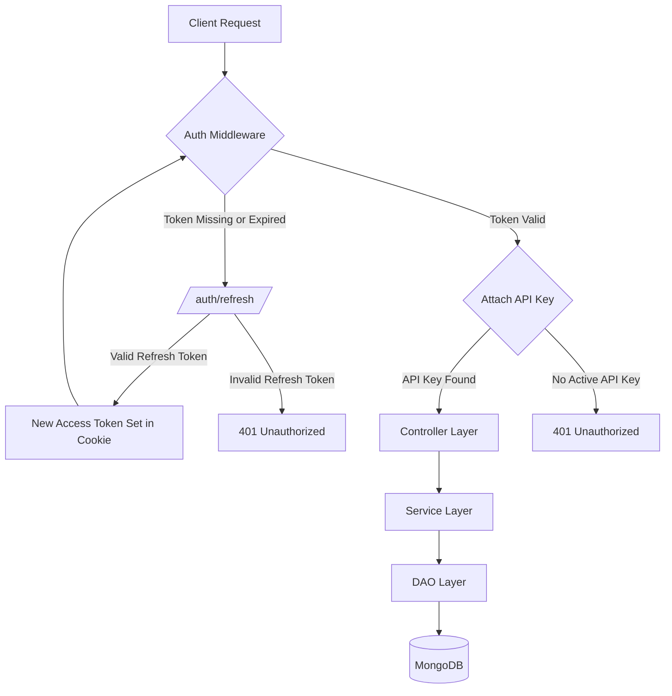

# Project Architecture Documentation

## Overview

**AlertForge Backend** is a production-ready incident management and monitoring system built on a robust, scalable architecture. It follows a strictly decoupled **Layered Architecture** (Controller -> Service -> DAO) to ensure maintainability, testability, and clear separation of concerns.

The system is designed with security as a priority, implementing cookie-based JWT authentication and a scoped API key system that ensures users can only access data associated with their active credentials.

---

## Authentication Flow

The system uses a dual-token strategy (Access + Refresh) delivered via secure, HttpOnly cookies to mitigate XSS risks.

### Request-Response Cycle

### 1. Token Generation and Verification

- **Access Tokens**: Short-lived (15 minutes), used for authorizing individual requests.
- **Refresh Tokens**: Long-lived (7 days), stored in the database or verified via secret to issue new access tokens without requiring user re-login.
- **Verification**: Handled via `jsonwebtoken` in `src/utils/token.js`.

### 2. Cookie Security Configuration

Tokens are stored in the browser using the following security flags:

- `httpOnly: true`: Prevents client-side scripts from accessing tokens (XSS protection).
- `secure: true`: Production-only setting that ensures tokens are only sent over HTTPS.
- `sameSite: "lax" / "none"`: Protects against CSRF attacks.

---

## Layered Architecture

The project is organized into four distinct layers:

| Layer                              | Responsibility                                                    | Location            |
| :--------------------------------- | :---------------------------------------------------------------- | :------------------ |
| **Routes**                   | Defines endpoints and applies middleware chains.                  | `src/routes/`     |
| **Controllers**              | Orchestrates HTTP lifecycle (`req`/`res`) and calls services. | `src/controller/` |
| **Services**                 | Encapsulates business logic, validation, and complex workflows.   | `src/services/`   |
| **DAO (Data Access Object)** | Performs direct database operations using Mongoose models.        | `src/dao/`        |

---

## Middleware Pipeline

Requests flow through a series of specialized middlewares before reaching the business logic:

1. **`publicApiLimiter`**: Baseline rate limiting for all incoming traffic.
2. **`authMiddleware`**:
   - Extracts `accessToken` from cookies.
   - Verifies JWT validity.
   - Attaches `userId` to `req.user`.
3. **`attachApiKey`**:
   - Retrieves the user's active API key from the database.
   - Attaches the `apiKey` object to `req.apiKey` for data scoping.
4. **`authApiLimiter`**: Tiered rate limiting for authenticated users.

---

## API Key System

AlertForge utilizes a scoped API key system to identify services and enforce ownership:

- **Storage**: API keys are hashed (`SHA-256`) before being stored in MongoDB to prevent leaks from database snapshots.
- **Linking**: Each API key is linked to a `User` document.
- **Scoping**: Most resources (Incidents, Postmortems) are indexed by `apiKeyId`. This ensures that even within the same user account, data can be segmented by different integrated services.
- **Lifecycle**: Users can generate new keys via `/api/apikeys`. The system enforces a "one active key" policy per user for standard tiers.

---

## Request Lifecycle Example: Creating an Incident

1. **Client** sends `POST /api/incidents` with payload.
2. **`authMiddleware`** validates the session cookie.
3. **`attachApiKey`** identifies the active service key for the user.
4. **`incidentController.createIncident`** receives the request.
5. **`incidentService.createIncident`** validates the incident data and enriches it with `apiKeyId`.
6. **`incidentDAO.createIncidentDAO`** executes the `Mongoose.create()` command.
7. **Response** is returned to the client with a `201 Created` status.

---

## Token Lifecycle Management

- **Login/Register**: Both tokens are generated and set as cookies.
- **Token Expiry**: When a request fails due to an expired access token, the client hits `/auth/refresh`.
- **Refresh**: The server verifies the refresh token and issues a new `accessToken` cookie.
- **Logout**: Clears both cookies and invalidates the session on the client side.
