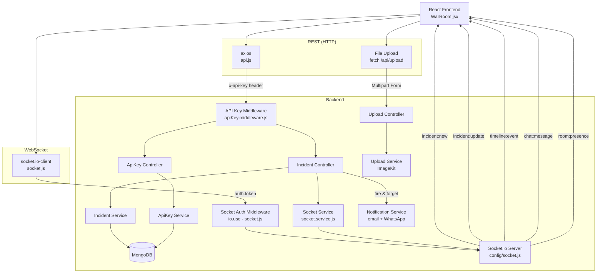
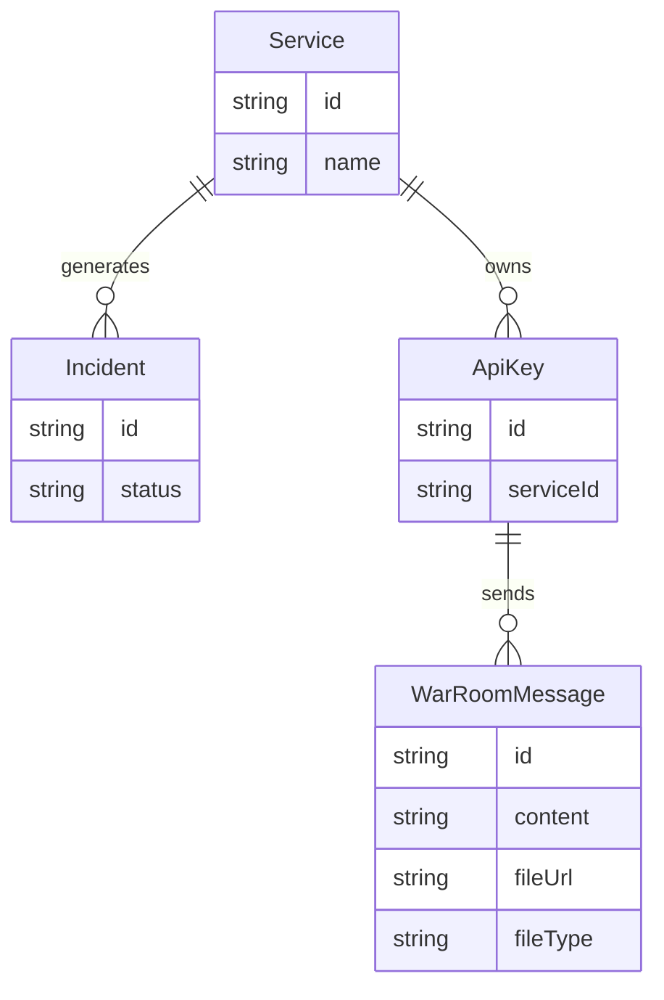

# 🚀 MVP STATUS

_Last updated: 2026-05-02_

---

## ✅ DONE

| Feature                                   | File                                               |
| :---------------------------------------- | :------------------------------------------------- |
| Incident CRUD API                         | `incident.routes.js`, `incident.controller.js`     |
| MongoDB Incident model                    | `Incident.model.js`                                |
| API key generation (POST /api/apikeys)    | `apikey.controller.js`                             |
| API key hashing (SHA-256)                 | `hashKey.js`                                       |
| API key DB validation (REST middleware)   | `apiKey.middleware.js`                             |
| API key DB validation (Socket auth)       | `socket.js` — `io.use()` middleware               |
| Socket.io server + singleton              | `config/socket.js`                                 |
| `incident:new` emit                       | `socket.service.js` → `createIncident`            |
| `incident:update` emit                    | `socket.service.js` → `updateIncidentStatus`      |
| `timeline:event` emit                     | `socket.service.js` → both controllers            |
| War Room room scoping (`join_room`)       | `config/socket.js`                                 |
| Responder presence tracking               | `config/socket.js` — in-memory Map                |
| `room:presence` broadcast                 | `config/socket.js`                                 |
| Room-scoped emit (service filter)         | `socket.service.js` — `resolveTarget()`           |
| Email notification (nodemailer)           | `email.service.js`                                 |
| WhatsApp notification (Twilio)            | `whatsapp.service.js`                              |
| Frontend API client (axios + interceptor) | `services/api.js`                                  |
| Frontend socket client + handshake auth   | `services/socket.js`                               |
| Frontend War Room dashboard               | `pages/WarRoom.jsx`                                |
| Live incident list (socket-driven)        | `WarRoom.jsx` — `upsertIncident`                  |
| Timeline event log (socket-driven)        | `WarRoom.jsx` — `handleTimelineEvent`             |
| Quick resolve button (PATCH status)       | `WarRoom.jsx` — `handleQuickResolve`              |
| Auto `join_room` on service input         | `WarRoom.jsx` — `handleServiceChange`             |
| Responder online count display            | `WarRoom.jsx` — `room:presence` listener          |
| Socket reinitialization on key change     | `WarRoom.jsx` — `reinitializeSocket()`            |
| **In-app War Room chat / messaging**      | `WarRoomChat.jsx`, `socket.js`, `chat.service.js` |
| **File Sharing (Image/PDF via ImageKit)** | `upload.routes.js`, `imagekit.service.js`          |
| **MongoDB Chat persistence**              | `WarRoomMessage.model.js`                          |
| **Socket Error Standardization**          | `error:event` implementation                      |

---

## ⚠️ PARTIAL

| Feature            | Issue                                                 |
| :----------------- | :---------------------------------------------------- |
| WhatsApp recipient | Hardcoded `+91XXXXXXXXXX` — not dynamic              |
| Email recipient    | Hardcoded `ritammaty2005@gmail.com` — not dynamic    |
| Responder presence | In-memory only — resets on server restart; no Redis    |
| Environment Config | CORS/Upload API depend on `VITE_API_BASE_URL` envs    |

---

## ❌ NOT DONE

| Feature                                                   |
| :-------------------------------------------------------- |
| Webhook ingestion endpoint (UptimeRobot / PagerDuty)      |
| User accounts / JWT auth                                  |
| Redis adapter (multi-server Socket.io)                    |
| AI root cause analysis                                    |
| Audit log / incident history                              |
| Service registry (`Service.model.js` exists but unused)   |
| Webhook log (`WebhookLog.model.js` exists but unused)     |
| Rate limiting on API routes                               |

---

## 🔄 SYSTEM OVERVIEW

---

## 📦 MODEL SUMMARY

---

## 📡 API ROUTES

| Method    | Route                         | Auth         | Status       |
| :-------- | :---------------------------- | :----------- | :----------- |
| `POST`    | `/api/apikeys`                | ❌ None      | ✅           |
| `POST`    | `/api/incidents`              | ✅ x-api-key | ✅           |
| `GET`     | `/api/incidents`              | ✅ x-api-key | ✅           |
| `PATCH`   | `/api/incidents/:id/status`   | ✅ x-api-key | ✅           |
| `POST`    | `/api/upload`                 | ✅ Multipart | ✅           |
| `POST`    | `/api/webhooks`               | —            | ❌ Not built |
