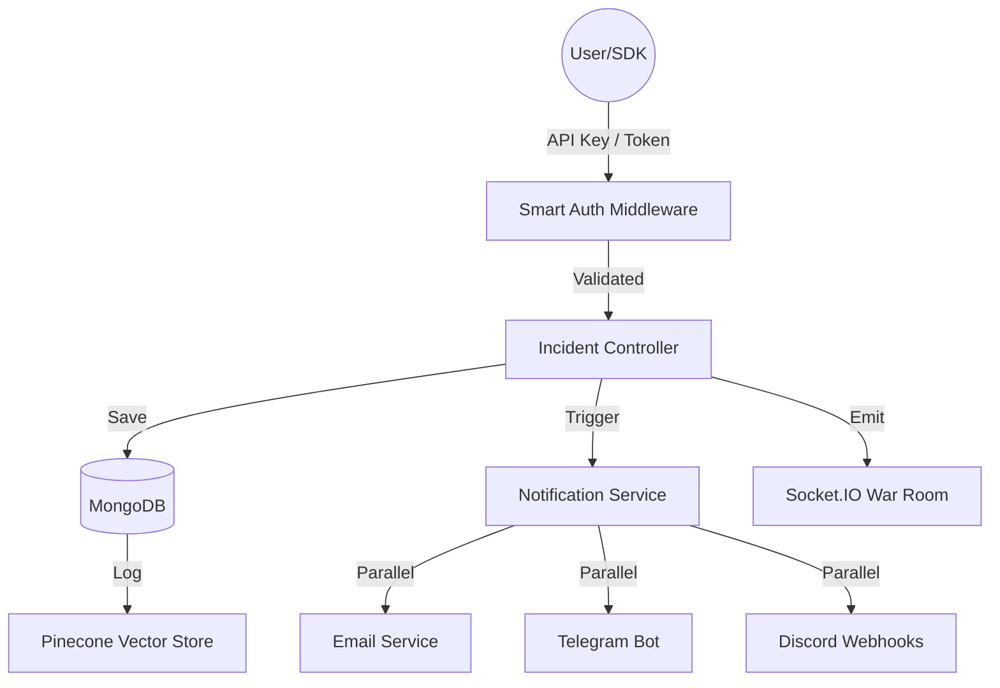
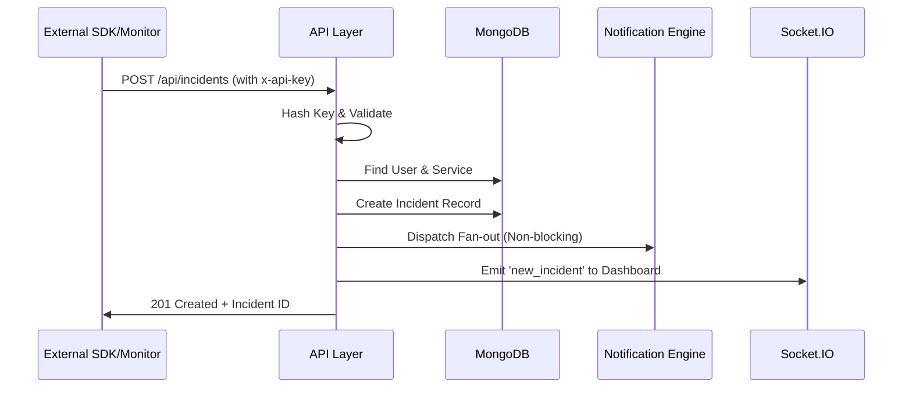
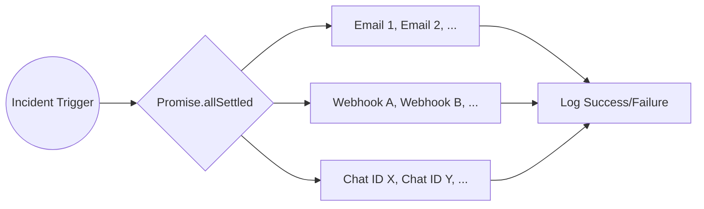

# AlertForge: Project Status & Architecture

**AlertForge** is a production-grade, real-time incident management and multi-channel alerting platform. It allows developers and teams to monitor services, receive instant notifications across multiple platforms, and collaborate in real-time "War Rooms" to resolve incidents.

---

## 🏗️ Current System Architecture

The AlertForge backend is built on a **Layered Architecture (Controller-Service-DAO)** using Node.js, Express, and MongoDB. It integrates several high-performance tools for real-time communication and intelligence.

### 1. Authentication System (Smart Auth)
The system employs a **dual-mode authentication** strategy:
- **API Key Flow**: Used by SDKs and external monitors (e.g., UptimeRobot). Keys are hashed in the database for security.
- **Dashboard Flow**: Uses JWT-based access tokens stored in cookies for web-based management.
- **Resolution**: Both flows inject a `req.apiKey` and `req.user` object into the request context for downstream services.

### 2. Incident Management
Incidents are the core entity. They track service health, severity levels, and resolution status. Every incident is linked to an API Key, which in turn maps to a User.

### 3. Notification Engine (Fan-out)
A robust, non-blocking notification system that supports:
- **Email**: Primary and team-based alerts.
- **Telegram**: Multi-chatId support via bot integration.
- **Discord**: Multi-webhook support for channel-specific alerts.
- **Parallelism**: All notifications are dispatched simultaneously using `Promise.allSettled()`.

### 4. Real-time Infrastructure
- **Socket.IO**: Powers the "War Room" chat and live incident dashboard.
- **Redis**: Used for distributed state and potentially as a Socket.IO adapter (currently in single-server mode due to configuration constraints).

### 5. Intelligence Layer
- **Pinecone**: Integrated for vector-based search and potential AI-driven postmortem analysis.
- **Timeline System**: Automatically tracks every action related to an incident.

---

## 📊 Feature Status Table

| Feature | Status | Notes |
| :--- | :--- | :--- |
| **Smart Auth Middleware** | ✅ Done | Supports both API Keys and Dashboard Tokens. |
| **API Key Hashing** | ✅ Done | Secure storage and validation system. |
| **Incident Creation** | ✅ Done | Fully functional via REST and Webhooks. |
| **Multi-channel Fan-out** | ✅ Done | Parallel delivery to Email, Telegram, and Discord. |
| **Telegram (Multi-chatId)**| ✅ Done | Users can configure multiple chat IDs. |
| **Discord (Multi-webhook)** | ✅ Done | Users can configure multiple webhook URLs. |
| **Email (Team Emails)** | ✅ Done | Supports primary and multiple team CCs. |
| **War Room Feature** | ✅ Done | Real-time chat and presence tracking. |
| **Socket.IO Updates** | ✅ Done | Live updates for new incidents and status changes. |
| **Timeline System** | ✅ Done | Persistent history of all incident events. |
| **Notification Settings** | ✅ Done | Per-user toggles for every channel. |
| **Redis Integration** | ⚠️ In Progress | Basic mode working; TCP/RESP URL needed for advanced features. |
| **Pinecone Integration** | ✅ Done | Client initialized and connected to index. |
| **Retry Mechanism** | ⏳ Planned | For handling transient notification delivery failures. |

---

## 🗄️ Data Models Summary

### User Model
- **email**: Primary account identifier.
- **teamEmails**: Array of additional alert recipients.
- **telegramChatIds**: Array of authorized Telegram chats.
- **discordWebhookUrls**: Array of Discord webhook endpoints.
- **notificationSettings**: Boolean toggles (`emailEnabled`, `telegramEnabled`, `discordEnabled`).

### ApiKey Model
- **key**: Hashed version of the API key.
- **user**: Reference to the owner (ObjectId).
- **serviceName**: The name of the service this key monitors.
- **isActive**: Boolean status.

### Incident Model
- **message**: Description of the alert.
- **service**: Originating service name.
- **severity**: `low`, `medium`, `high`, `critical`.
- **status**: `open`, `acknowledged`, `resolved`.
- **apiKeyId**: Reference to the key that triggered it.

---

## 🔄 Core Workflows

### 1. System Architecture Diagram

### 2. Incident Creation Flow

### 3. Notification Fan-out Diagram

---

## 🛠️ Current Problems / Tech Debt

1.  **Redis Configuration**: The environment currently detects a REST URL, which skips the TCP adapter. Full scalability across multiple processes requires a valid `rediss://` RESP URL.
2.  **Notification Retries**: Currently, if a webhook fails (e.g., 404 or 500 from Discord), the system logs the error but does not retry. A background queue (like BullMQ) is recommended.
3.  **Input Sanitization**: While validation exists, further hardening of external webhook payloads (like UptimeRobot) is ongoing.
4.  **Socket Identity**: Some socket connections occasionally show `service: undefined` if the handshake timing is off.

---

## 🏁 Final System Status Summary

-   **Production-Ready**: The Core Incident API, Multi-channel Fan-out, and Smart Auth are highly stable and ready for use.
-   **Scalable**: The notification system is already optimized using `Promise.allSettled`.
-   **Partially Limited**: Advanced Redis features (distributed rate limiting, horizontal socket scaling) are disabled until the TCP connection is configured.

---
*Last Updated: 2026-05-02*
