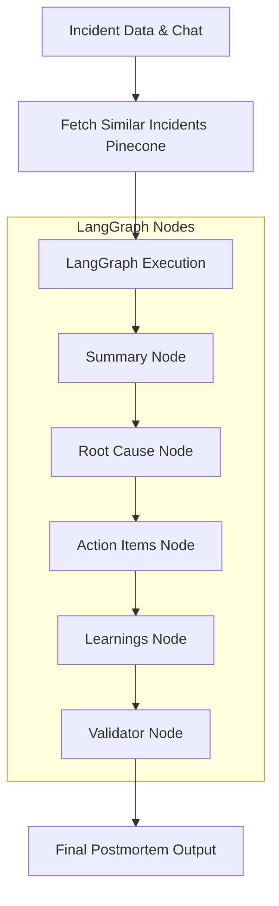

# 🧠 AI Postmortem System (LangGraph)

## 1. System Overview

The AI Postmortem System is an automated, intelligence-driven diagnostic pipeline within **AlertForge**. By ingesting core incident data, event timelines, real-time war room chat logs, and historically similar incidents via Pinecone vector search, the system utilizes LangGraph to generate highly accurate, structured postmortem reports. 

LangGraph orchestrates the reasoning process by breaking down the analysis into discrete, specialized agent nodes. This prevents hallucinations and ensures the AI systematically identifies root causes, extracts actionable insights, and generates preventative tasks without manual effort.

## 2. Input → Output Flow

The system processes data sequentially through specialized AI nodes, ensuring each phase of the postmortem is grounded in actual operational evidence.



**Data Pipeline:**
`Incident Data → LangGraph Nodes → Analysis → Root Cause → Action Items → Final Postmortem`

## 3. Output Schema

The system outputs a strictly validated JSON object enforcing the following schema:

* **`rootCause`** *(String)*: The fundamental technical or procedural failure that caused the incident.
* **`summary`** *(String)*: A chronological overview of the impact, detection, and mitigation.
* **`contributingFactors`** *(Array of Strings)*: Secondary issues that exacerbated the outage or delayed recovery.
* **`learnings`** *(Array of Strings)*: High-level takeaways to improve system resilience.
* **`actionItems`** *(Array of Objects)*: Specific preventative tasks.
  * `description` *(String)*: What needs to be done.
  * `owner` *(String)*: The role responsible (e.g., Backend, DevOps, QA, Manager).
  * `deadline` *(String)*: Suggested timeframe (e.g., "1 week", "immediate").
  * `status` *(String)*: Current state, typically defaults to "pending".
* **`aiConfidence`** *(Number)*: A score (0-100) indicating the LLM's certainty based on evidence quality.
* **`createdAt`** / **`updatedAt`** *(String)*: ISO timestamps.
* **`incidentId`** *(String)*: Reference to the parent AlertForge incident.

## 4. Action Items Intelligence

The Action Items Node leverages role-based intelligence to automatically distribute recovery tasks across the engineering organization:

* **Multi-Role Assignment**: The AI parses the technical nature of the failure to assign tasks to specific operational roles (e.g., assigning database indexing to `Backend`, deployment pipeline fixes to `DevOps`, or test coverage to `QA`).
* **Deadline Assignment Logic**: Criticality dictates deadlines. Security or data-loss vulnerabilities receive "immediate" or "24 hours" deadlines, while technical debt receives "1 week" or "next sprint" suggestions.
* **Status Tracking**: All generated items initialize with a "pending" status, ready to be synced with Jira or internal issue trackers.

## 5. AI Reasoning Layer

The LangGraph architecture mimics human incident investigation:

* **Root Cause Determination**: The AI cross-references error logs in the timeline with commands run by engineers in the War Room chat. It looks for the *first* point of failure rather than the symptom.
* **Extracting Contributing Factors**: The model specifically identifies delays in detection, missing alerts, or confusing runbooks that made the incident harder to resolve.
* **Generating Learnings**: By comparing the current incident against Pinecone historical vectors, the AI extracts systemic themes (e.g., "We repeatedly fail to scale Redis during flash sales").
* **Confidence Scoring**: If the chat logs are empty or the timeline is sparse, the Validator Node lowers the `aiConfidence` score, flagging the postmortem for human review.

## 6. Real Example Response

Below is a real example of the final API JSON response generated by the LangGraph pipeline:

```json
{
  "incidentId": "incident:69f57b5f67e950cb4a046332",
  "summary": "At 04:30 UTC, the primary payment gateway began timing out, resulting in a 15% drop in successful checkouts. The alert fired at 04:35 UTC. Responders joined the War Room, identified a database connection pool exhaustion issue, and manually scaled the max connections to resolve the incident at 04:50 UTC.",
  "rootCause": "The payment microservice exhausted its database connection pool because a recent deployment introduced an unpaginated query that held connections open for too long under high load.",
  "contributingFactors": [
    "No active monitoring on the database connection pool utilization.",
    "The unpaginated query bypassed QA performance testing.",
    "Initial responders lacked access to scale the database immediately."
  ],
  "learnings": [
    "All queries touching the transactions table must enforce strict pagination.",
    "Connection pool metrics must be treated as critical telemetry."
  ],
  "actionItems": [
    {
      "description": "Refactor the transaction history query to use cursor-based pagination.",
      "owner": "Backend",
      "deadline": "Immediate",
      "status": "pending"
    },
    {
      "description": "Implement Datadog alerts for DB connection pool > 80% capacity.",
      "owner": "DevOps",
      "deadline": "24 hours",
      "status": "pending"
    },
    {
      "description": "Add load testing to the CI/CD pipeline for the payment service.",
      "owner": "QA",
      "deadline": "1 week",
      "status": "pending"
    }
  ],
  "aiConfidence": 92,
  "createdAt": "2026-05-02T05:38:15.480Z",
  "updatedAt": "2026-05-02T05:38:15.480Z"
}
```

## 7. Improvements / Future Enhancements

Based on the system's current analytical capabilities, the following enhancements are planned:

* **Severity Auto-Classification**: Use the AI to retroactively assess if the incident's assigned severity matched its actual impact.
* **Timeline Reconstruction**: Automatically generate a millisecond-accurate timeline table from scattered chat logs and system alerts.
* **Incident Recurrence Detection**: Hard-block pull requests or deployments if the AI detects the exact same root cause returning within 30 days.
* **Prevention Suggestions**: Automatically generate Terraform or Pulumi snippets to patch infrastructure gaps identified in the postmortem.
* **War Room Integration**: Feed the generated Action Items back into the live War Room chat so responders can instantly accept and track tasks before disconnecting.
