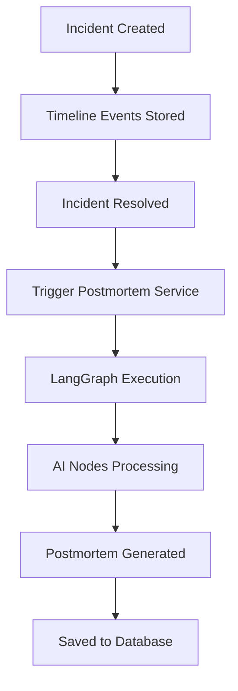
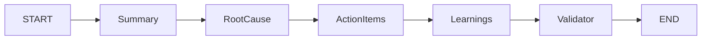
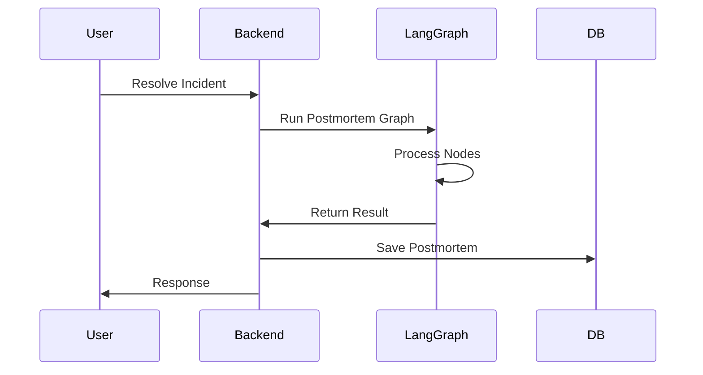

# 🧠 AI Postmortem System (LangGraph)

## 1. Overview

This system turns a resolved incident into a structured postmortem.

It follows an incident → AI → postmortem flow:

- The incident is created and timeline events are stored.
- When the incident is resolved, the backend triggers postmortem generation.
- LangGraph processes the incident context step by step.
- The final postmortem is validated and saved to MongoDB.

## 2. How It Works

1. An incident is created and tracked through its lifecycle.
2. Timeline events capture important response activity.
3. When the incident becomes resolved, the backend triggers the postmortem service.
4. The service loads the incident, timeline, and similar incidents.
5. LangGraph runs multiple AI nodes to build the postmortem.
6. The output is validated and stored in the database.
7. The API can also generate the postmortem manually when needed.

## 3. Architecture Diagram

## 4. LangGraph Flow

The LangGraph pipeline breaks postmortem generation into focused steps:

- Summary node: creates a concise incident summary.
- Root cause node: identifies the most likely cause and contributing factors.
- Action node: generates practical follow-up action items.
- Learning node: captures the key lesson from the incident.
- Validator node: checks the final output and confirms it matches the expected schema.

This structure keeps the logic modular, easier to maintain, and ready for future graph enhancements.

## 5. Folder Structure

Important AI-related folders live under `src/services/ai/`:

- `langgraph.service.js`: defines and runs the full LangGraph workflow.
- `nodes/`: contains the individual AI processing steps.
- `prompts/`: stores prompt builders for each node.
- `utils/`: contains shared helpers for model setup, parsing, and formatting.

## 6. API Flow

The system supports both automatic and manual generation.

- Automatic trigger: when an incident becomes resolved, the backend generates the postmortem.
- Manual trigger: an API endpoint can generate or refresh the postmortem for a specific incident.

## 7. Key Features

- AI-based root cause analysis
- Structured postmortem output
- Idempotent generation to avoid duplicates
- Modular LangGraph architecture
- Ready for future workflow expansion

## 8. Future Improvements

- Better prompt tuning for more accurate reports
- Retry loops for low-confidence outputs
- Memory-based learning across incidents
- Enhanced similarity search for recurring incidents
