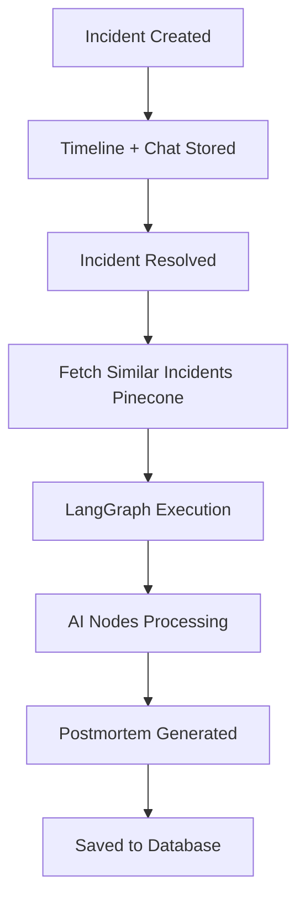
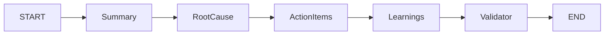
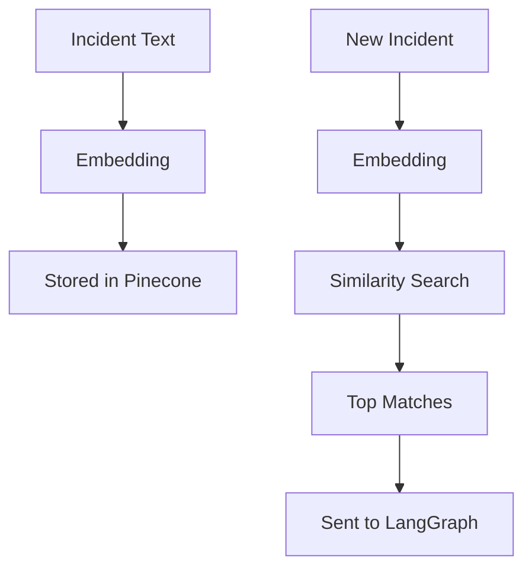
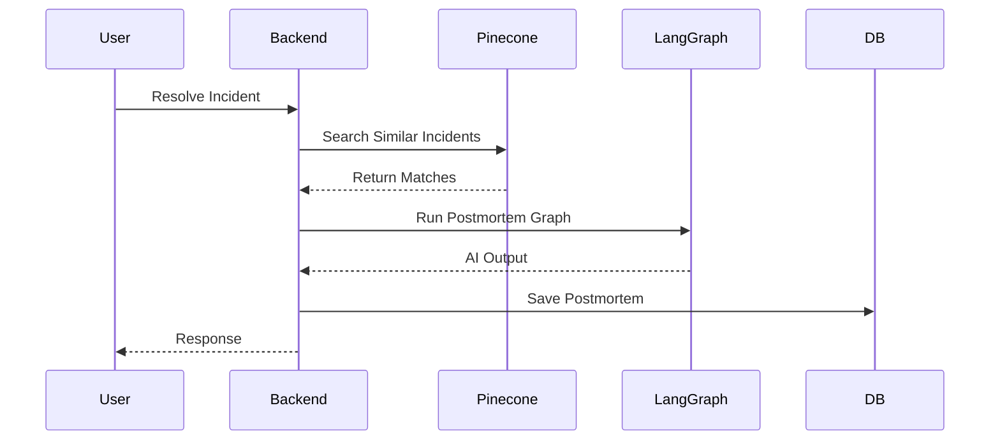

# 🧠 AI Postmortem System (LangGraph)

## 1. Overview

The AI Postmortem System is an automated, intelligence-driven diagnostic pipeline. By ingesting the core incident data, the event timeline, real-time war room chat logs, and historically similar incidents via Pinecone vector search, the system utilizes LangGraph to generate highly accurate postmortem reports, identifying root causes and actionable insights without manual effort.

## 2. How It Works

1. **Incident Created**: An alert triggers an incident within the system.
2. **Timeline Stored**: System events and status changes are recorded chronologically.
3. **War Room Chat Captured**: Real-time responder communication is logged.
4. **Incident Resolved**: The response team mitigates the issue and closes the incident.
5. **Pinecone Search**: The system queries the vector database for historically similar incidents.
6. **LangGraph Execution**: The AI graph boots up, processing the complete contextual payload.
7. **Postmortem Generated**: A structured, comprehensive postmortem report is finalized and saved.

## 3. Architecture Diagram

## 4. LangGraph Flow

The core logic executes through specialized nodes that process the incident state sequentially. **Each node is fed the complete context: incident metadata, timeline, war room chat, and similar incidents.**

* **summary node**: Consolidates raw timeline and chat data into a clear chronological summary.
* **root cause node**: Investigates technical logs and responder chats to pinpoint the failure origin.
* **action node**: Generates specific, preventative tasks based on the failure analysis and past mistakes.
* **learning node**: Extracts high-level architectural or procedural lessons for the team.
* **validator node**: Checks the integrity and quality of the generated content before finalizing.

## 5. Context Intelligence

The AI engine now leverages a multi-source data model for vastly superior reasoning. Instead of just looking at the final status, the AI processes:

* **Incident data**: Understanding *what* happened, severity, and impacted services.
* **Timeline**: Tracing the exact sequence of events and automated system changes.
* **War Room chat**: Observing the *real debugging process*, capturing hypotheses, dead ends, and the exact commands used by engineers.
* **Pinecone**: Pulling historical similarity to catch recurring architectural flaws that humans might miss.

By aggregating these sources, the AI reduces hallucinations and grounds its root-cause analysis in actual responder evidence.

## 6. Pinecone Flow

To enable cross-incident learning, the system automatically vectorizes operational data:

* Resolved incidents and chat messages are converted into embedding vectors.
* These vectors are securely stored in a Pinecone index alongside metadata.
* When a new incident resolves, its text is embedded and queried against the index.
* The top matching historical incidents are returned and injected directly into the LangGraph context.

## 7. API Flow

The system supports automated triggers upon resolution, orchestrating external integrations smoothly.

## 8. Key Improvements

* **Context-aware AI**: Fuses metadata, timelines, and chat into a single reasoning flow.
* **Uses real chat data**: Captures engineer thought processes for deeper technical accuracy.
* **Learns from past incidents**: Pinecone integration prevents recurring failures.
* **Better root cause accuracy**: Eliminates generic AI responses by grounding assertions in evidence.
* **Scalable AI architecture**: Cleanly decouples embedding, searching, and graph execution.

## 9. Folder Structure

The implementation resides in `src/services/ai/` with the following organization:

* **langgraph.service.js**: Main service responsible for graph definition and execution logic.
* **nodes/**: Contains individual logic and configurations for each AI agent node.
* **prompts/**: Stores template-based system prompts for the LLM agents.
* **utils/**: Helper functions for Pinecone (`pinecone.js`), embeddings (`embedding.js`), and formatting.

## 10. Future Improvements

* **Better prompts**: Refinement of context windows based on specific incident categories.
* **Loop retries in LangGraph**: Adding conditional edges to re-process low-confidence nodes.
* **Automated Runbook Updates**: Translating generated action items directly into runbook pulls.
