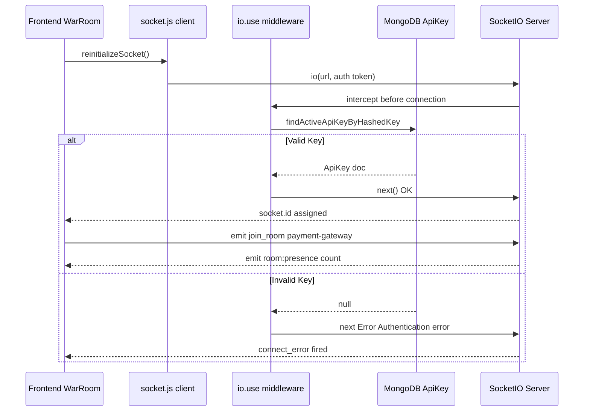
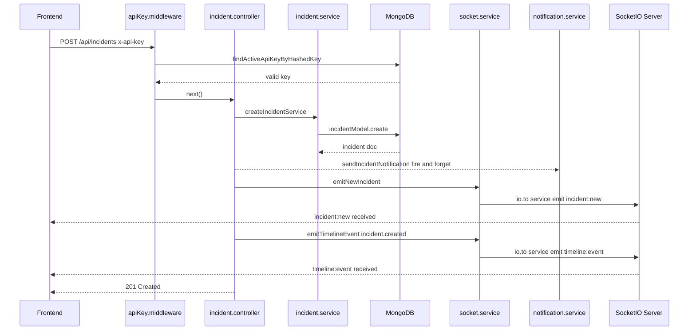
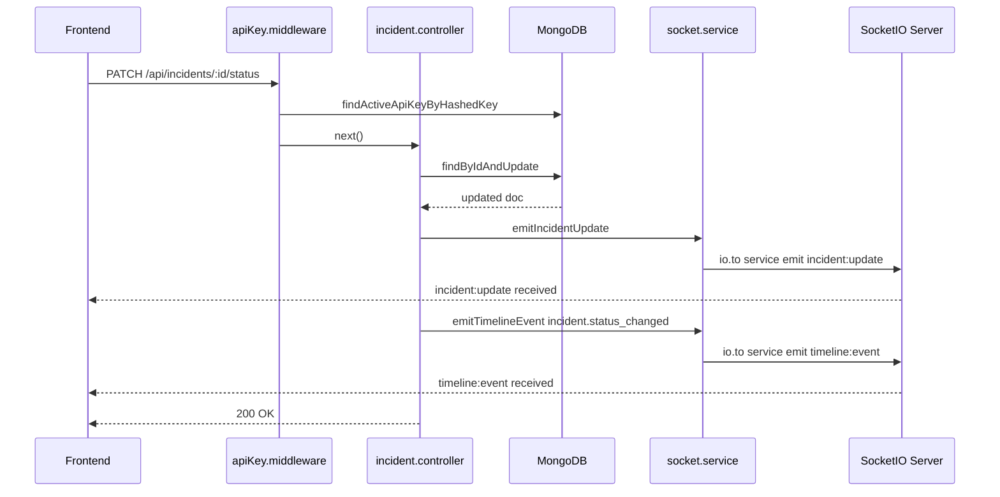
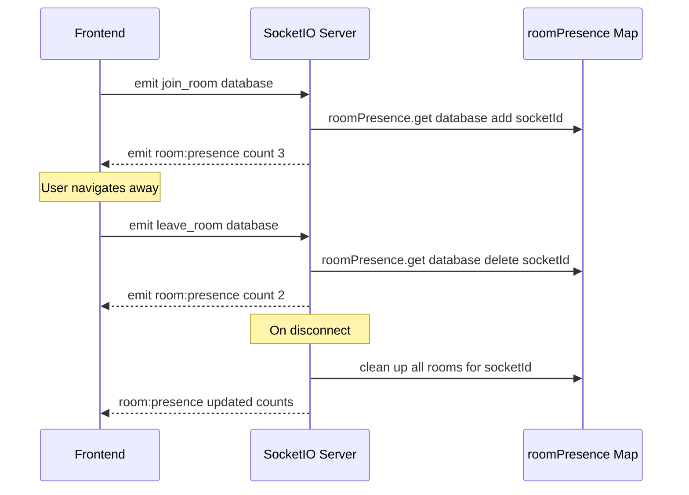
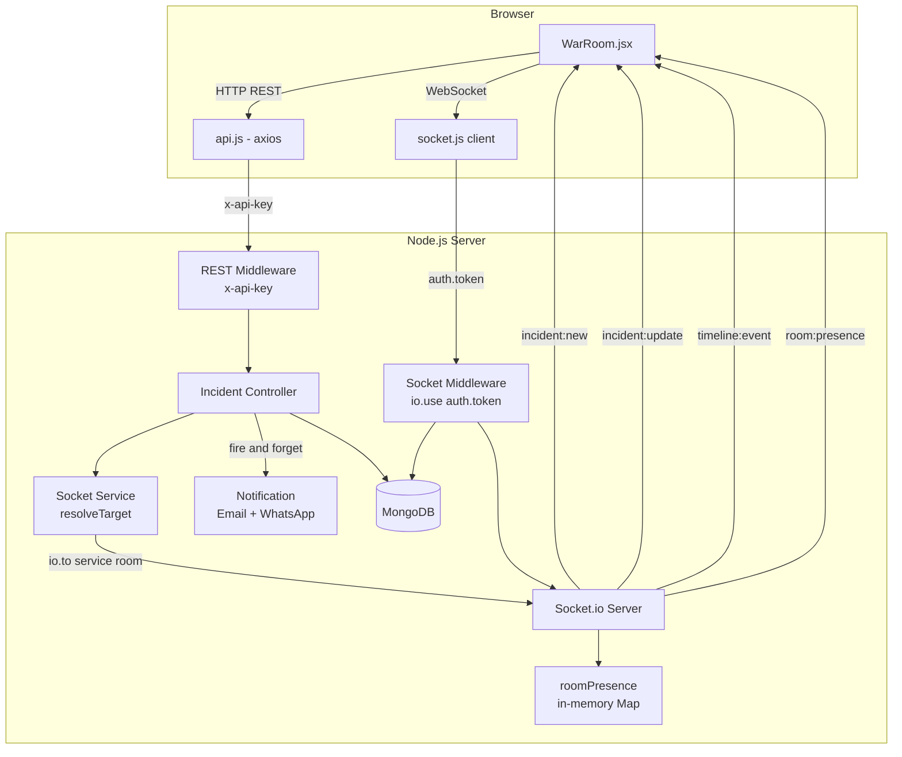

# 🔌 SOCKET.IO — SYSTEM FLOW

_Last updated: 2026-05-01_

---

## 🏗️ IMPLEMENTATION STATUS

| Feature | Status |
| :--- | :--- |
| Socket.io server (`initSocket`) | ✅ |
| Singleton pattern (`getIo`) | ✅ |
| CORS config | ✅ |
| Auth middleware (`io.use`) | ✅ |
| API key validation in socket auth | ✅ |
| `join_room` handler | ✅ |
| `leave_room` handler | ✅ |
| Responder presence tracking | ✅ |
| `room:presence` broadcast | ✅ |
| `incident:new` emit | ✅ |
| `incident:update` emit | ✅ |
| `timeline:event` emit | ✅ |
| Room-scoped emit (service filter) | ✅ |
| Global fallback emit | ✅ |
| Frontend handshake auth (`auth.token`) | ✅ |
| Frontend `join_room` on service input | ✅ |
| Frontend socket reinitialization on key change | ✅ |
| Redis adapter (multi-server) | ❌ |
| War Room chat | ❌ |
| Persistent presence (DB-backed) | ❌ |

---

## 1️⃣ CONNECTION & AUTH FLOW

---

## 2️⃣ CREATE INCIDENT FLOW

---

## 3️⃣ UPDATE INCIDENT FLOW

---

## 4️⃣ WAR ROOM PRESENCE FLOW

---

## 5️⃣ FULL SYSTEM TOPOLOGY

---

## 📦 EVENT REFERENCE

| Event | Direction | Payload | Scope |
| :--- | :--- | :--- | :--- |
| `incident:new` | Server → Client | `{ id, message, service, severity, status, createdAt, updatedAt }` | Service room / global |
| `incident:update` | Server → Client | `{ id, message, service, severity, status, createdAt, updatedAt }` | Service room / global |
| `timeline:event` | Server → Client | `{ type, incident: { ...payload } }` | Service room / global |
| `room:presence` | Server → Client | `{ room, count }` | Room members |
| `join_room` | Client → Server | `"service-name"` | — |
| `leave_room` | Client → Server | `"service-name"` | — |

---

## ⚠️ KNOWN LIMITATIONS

| Issue | Impact |
| :--- | :--- |
| Presence is in-memory | Resets on server crash/restart |
| No Redis adapter | Multi-server deploy will break socket routing |
| No chat events | War Room has no text messaging |
| CORS hardcoded | Must change before production deploy |
