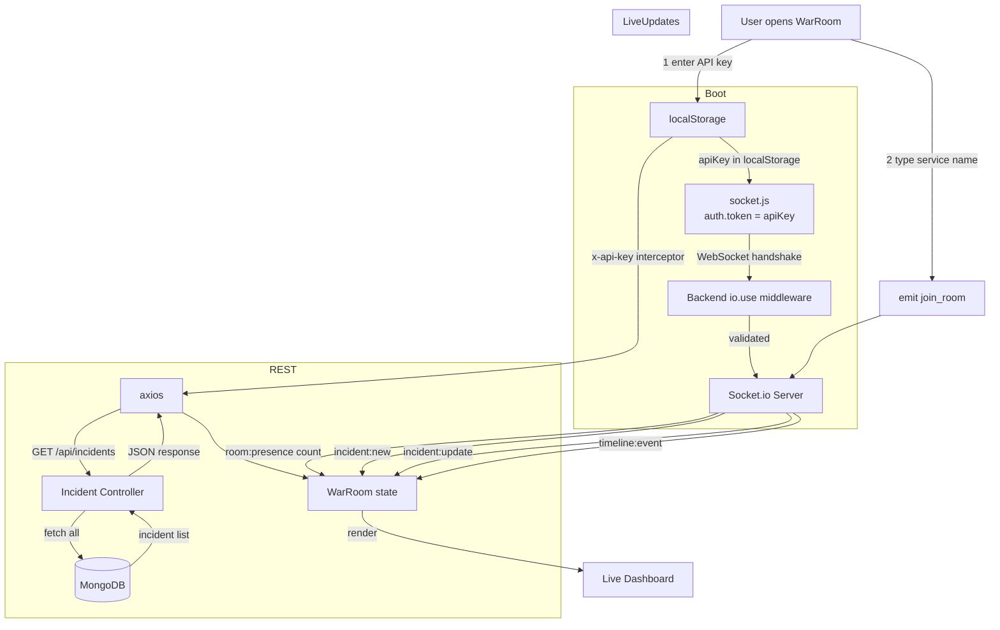
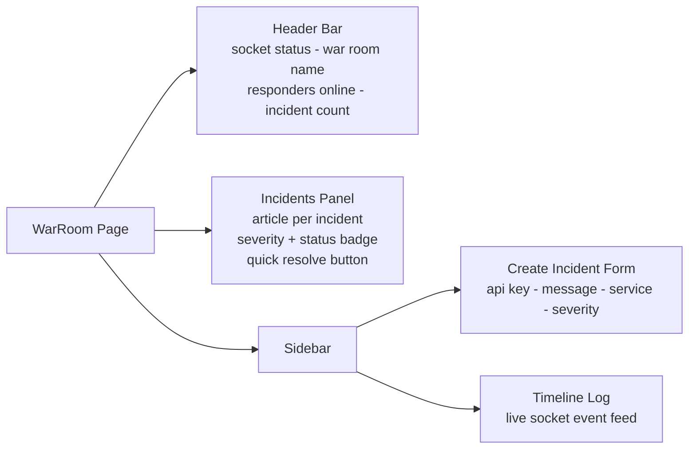

# 🏠 WAR ROOM — STATUS

_Last updated: 2026-05-01_

---

## ✅ DONE

| Feature | Where |
| :--- | :--- |
| Live incident list (socket-driven) | `WarRoom.jsx` — `handleNewIncident` |
| Incident deduplication / upsert | `WarRoom.jsx` — `upsertIncident()` |
| Live status update | `WarRoom.jsx` — `handleIncidentUpdate` |
| Timeline event log | `WarRoom.jsx` — `handleTimelineEvent` |
| Quick resolve button | `WarRoom.jsx` — `PATCH /api/incidents/:id/status` |
| Create incident form | `WarRoom.jsx` — `handleCreateIncident` |
| API key input (saved to localStorage) | `WarRoom.jsx` — `API_KEY_STORAGE_KEY` |
| Socket handshake auth (API key) | `services/socket.js` — `auth: { token }` |
| Socket reinitialization on key change | `WarRoom.jsx` — `reinitializeSocket()` |
| Auto `join_room` on service input | `WarRoom.jsx` — `handleServiceChange` |
| Responder online count | `WarRoom.jsx` — `room:presence` listener |
| Active War Room name display | `WarRoom.jsx` — `activeRoom` state |
| Socket status indicator (green/red) | `WarRoom.jsx` — conditional className |
| Incident severity + status badges | `WarRoom.jsx` — `severityStyles`, `statusStyles` |

---

## ⚠️ PARTIAL

| Feature | Issue |
| :--- | :--- |
| API key auth for create/resolve | Key read from localStorage but not re-validated on every action — relies on server-side middleware |
| Incident re-fetch on key change | `getIncidents(apiKey)` is called but signature doesn't pass key — interceptor handles it from localStorage |

---

## ❌ NOT DONE

| Feature |
| :--- |
| War Room chat / messaging |
| Typing indicator |
| Persistent timeline (DB-backed) |
| Responder assignment ("I'm on it" claim) |
| SLA / time-to-resolve timer |
| Filter incidents by severity or service |
| Pagination / infinite scroll |
| Incident detail / drill-down page |

---

## 🔄 WAR ROOM DATA FLOW

---

## 🖥️ UI COMPONENT BREAKDOWN

---

## 📊 STATE MAP

| State | Type | Updated By |
| :--- | :--- | :--- |
| `incidents` | `Incident[]` | REST fetch + `incident:new` + `incident:update` |
| `timeline` | `TimelineItem[]` | `incident:new`, `incident:update`, `timeline:event` |
| `socketStatus` | `"connected" \| "disconnected"` | socket `connect` / `disconnect` |
| `activeRoom` | `string` | `handleServiceChange` |
| `roomPresence` | `number` | `room:presence` event |
| `apiKey` | `string` | localStorage + form input |
| `form` | `{ message, service, severity }` | controlled inputs |
| `creating` | `boolean` | form submit lifecycle |
| `loading` | `boolean` | REST fetch lifecycle |
| `error` | `string` | any failed action |
