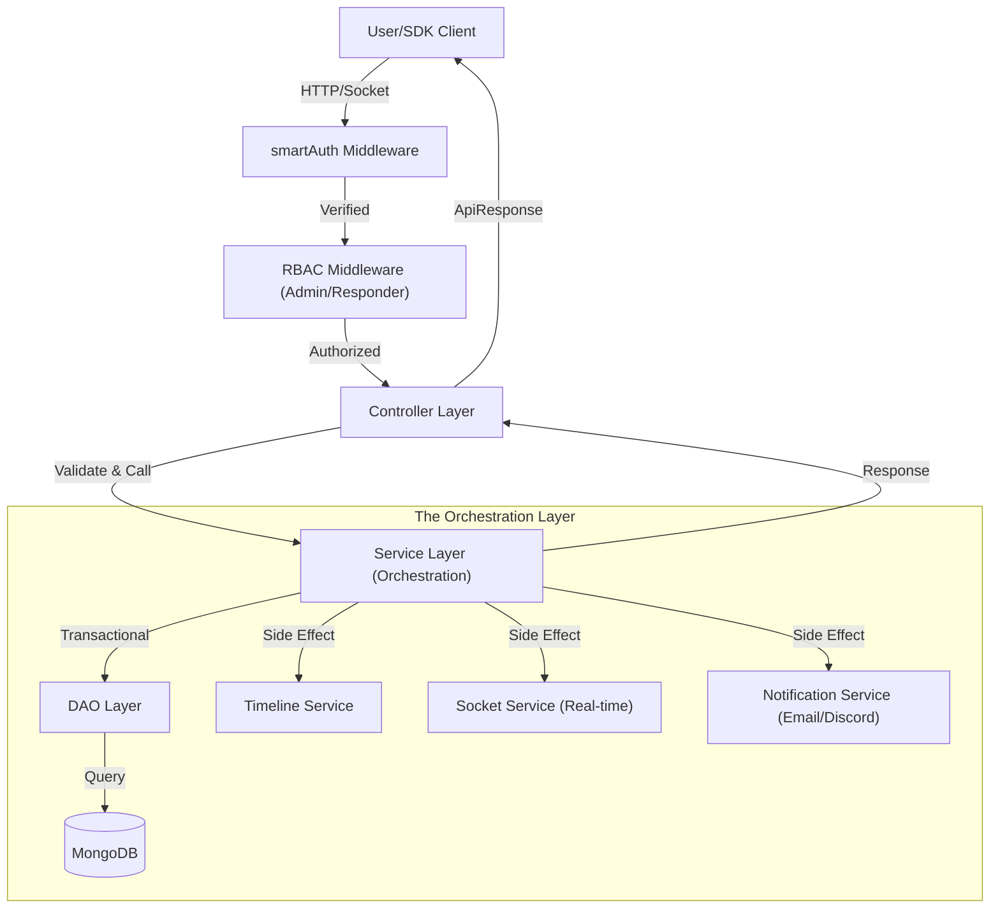
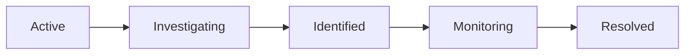
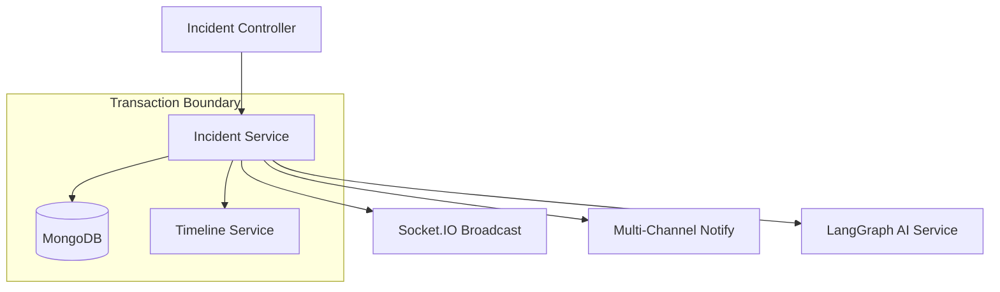
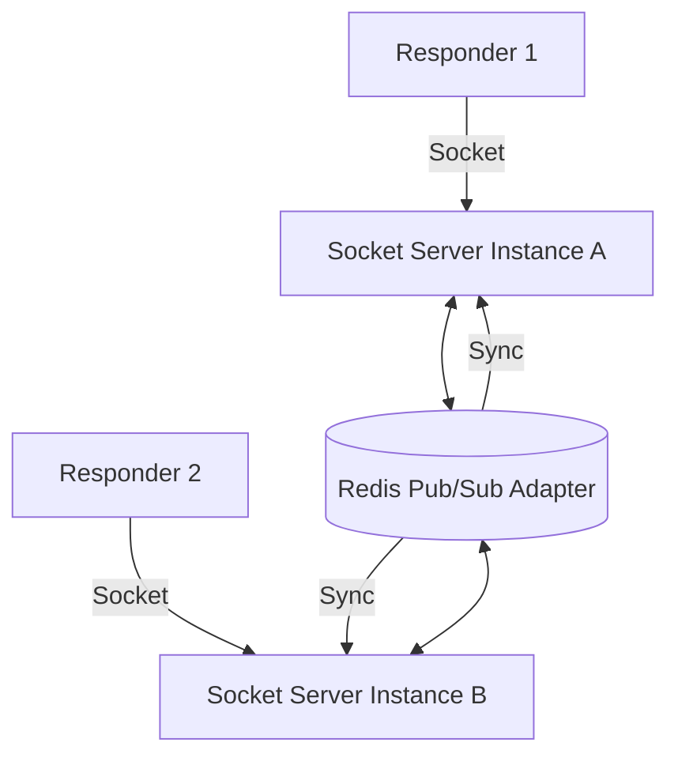
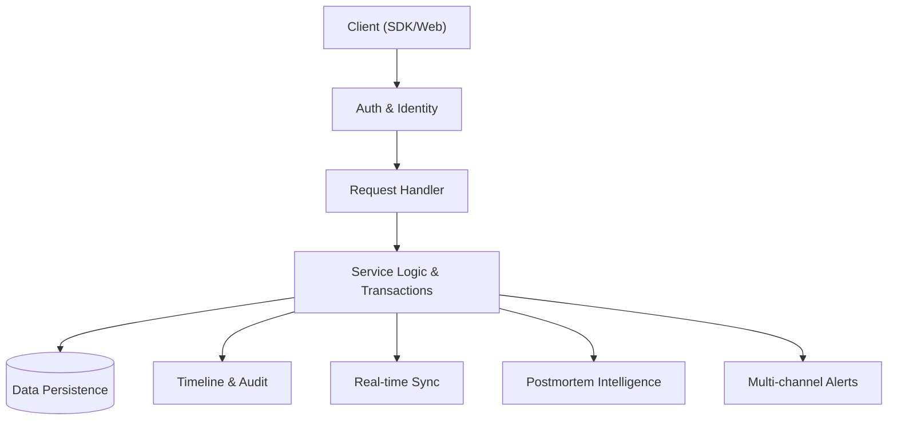
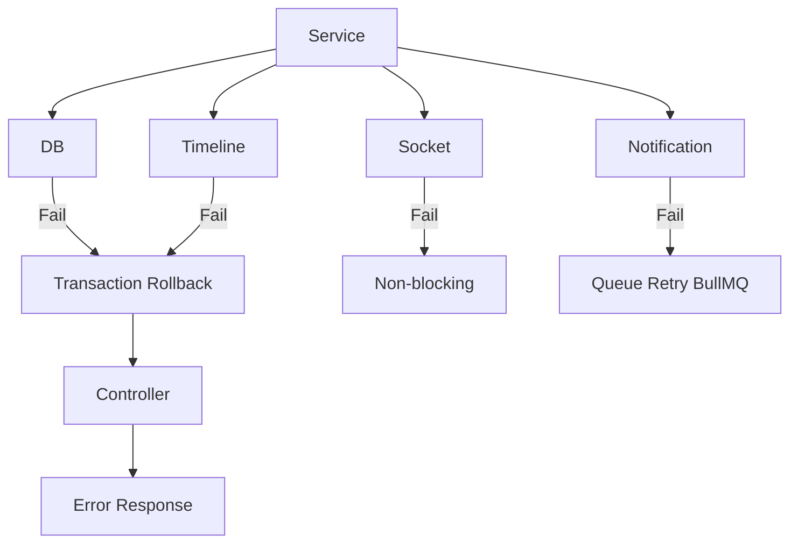

# AlertForge Backend — System Flow & Architecture Blueprint

This document serves as the comprehensive technical blueprint for the AlertForge backend. It outlines the architectural patterns, data flows, and security models that ensure the system is production-grade, scalable, and resilient.

---

## 1. High-Level Architecture Overview

AlertForge follows a strictly **Layered Architecture** to maintain a clean separation of concerns and ensure maintainability.

*   **Controller Layer**: The entry point for all HTTP requests. Controllers are "thin," responsible only for request validation, extracting parameters, and calling the appropriate service.
*   **Service Layer (The "Brain")**: The orchestration layer where business logic lives. It handles complex workflows, transactions, and side effects (like sending notifications or triggering AI).
*   **DAO (Data Access Object) Layer**: A thin wrapper around Mongoose models. DAOs are responsible for actual database queries and ensuring that every query is correctly scoped.
    *   **DAO Rules:** No business logic, no cross-service calls, only DB interaction, always enforce `organizationId` filtering.
*   **Model Layer**: Mongoose schemas defining the data structure and indexing strategy.

### Multi-Tenant Isolation
The system enforces **Organization-Level Scoping**. Every piece of data—incidents, services, timeline events—is tagged with an `organizationId`. This ensures strict data isolation between different teams while allowing shared access within a single organization.

---

## 2. 🔄 Full Request Lifecycle Diagram

The following diagram illustrates the standard path of a request through the system, including downstream side effects.

---

## 3. 🔐 Authentication Flow (Dual Mode)

AlertForge supports two distinct authentication methods, unified by the `smartAuth` middleware into a single normalized identity.

### A. Dashboard Flow (Cookie-based)
Used by the React frontend. Relies on secure HTTP-only cookies containing JWTs or session tokens.
### B. API Key Flow (SDK)
Used by external monitoring tools and the AlertForge SDK. Keys are transmitted via the `x-api-key` header and validated against hashed versions in the database.

**Identity Normalization:**
Regardless of the flow, `smartAuth` populates `req.user` with:
- `id`: The unique ID of the individual user.
- `organizationId`: The ID of the organization (Admin's User ID), used for data scoping.
- `role`: The user's permissions (admin, responder, viewer).

---

## 4. 🚨 Incident Lifecycle System

Incidents follow a strictly validated lifecycle to ensure data integrity and operational clarity.

**Lifecycle Orchestration:**
When a status transition occurs, the Service layer performs the following actions atomically (using MongoDB Transactions):
1.  **DB Update**: Persists the new status and timestamps (e.g., `resolvedAt`).
2.  **Timeline Log**: Automatically creates a record in the activity feed.
3.  **Socket Emit**: Broadcasts the change to the Service room and specific Incident room.
4.  **Sync**: Dyanmically updates the operational status of the affected **Service**.
5.  **AI Trigger**: If status is `Resolved`, the LangGraph pipeline is initiated to generate a Postmortem.

---

## 5. ⚙️ Service Layer Orchestration

The Service layer is the most critical part of the backend. It ensures that business rules are applied consistently and that side effects never fail silently or corrupt the primary state.

**Why this matters:**
- **Thin Controllers**: Controllers don't know *how* to resolve an incident; they only know which service to call.
- **Transactional Integrity**: Using `session.withTransaction()` ensures that if a database write fails, the entire request fails, preventing partial data updates.

---

## 6. 📡 Realtime System (Socket.IO + Redis)

Real-time collaboration is powered by Socket.IO with a **Redis Adapter** to support horizontal scaling across multiple server instances.

*   **Room Structure**: 
    - `service:<name>`: For dashboard-wide updates (new incidents, status changes).
    - `incident:<id>`: Specific "War Rooms" for live responder collaboration.
*   **Standardized Events**:
    - `room:join` / `room:leave`: Explicit presence management.
    - `message:new`: Instant chat and note synchronization.
    - `task:update`: Real-time status sync for responder checklists.
    - `presence:update`: Live count of active responders in a room.

---

## 7. 🧠 AI Postmortem Flow

Upon incident resolution, the system automatically triggers an AI-driven post-incident review (PIR) using a LangGraph pipeline.

1.  **Ingestion**: Collects the incident title, timeline events, and War Room logs.
2.  **Summary Engine**: Generates a concise executive summary.
3.  **Root Cause Analysis**: Correlates timeline events with external Tavily insights.
4.  **Action Items**: Proposes technical and process improvements.
5.  **Validation**: A secondary AI pass ensures no hallucinations and checks for technical accuracy.

---

## 8. 🗂️ Database Architecture

AlertForge uses MongoDB (Mongoose) with optimized indexing for high-traffic incident response.

| Model | Purpose | Primary Scoping |
| :--- | :--- | :--- |
| **User** | Identity, RBAC, and Team association. | `_id` |
| **Incident** | The core entity for tracking outages. | `organizationId` |
| **Service** | The registry of infrastructure assets. | `organizationId` |
| **TimelineEvent** | Durable activity log for audit trails. | `organizationId`, `incidentId` |
| **Postmortem** | AI-generated root cause documentation. | `incidentId` |
| **ApiKey** | Secure access tokens for the SDK. | `userId` |
| **WarRoomMessage** | Real-time chat and task data. | `organizationId`, `roomId` |

---

## 9. 🔒 Security Architecture

*   **RBAC (Role-Based Access Control)**: Middleware enforces `admin`, `responder`, and `viewer` roles at the route level.
*   **API Key Hashing**: Only SHA-256 hashes of API keys are stored in the database; raw keys are never saved.
*   **Organization Isolation**: The DAO layer is the final gatekeeper, injecting `{ organizationId }` into every `find`, `update`, and `delete` query.

### Additional Security Layers
- Rate limiting per IP and API key
- Input validation via Zod/Joi schemas
- Prevent over-fetching (projection in DAO)

---

## 10. ⚡ Performance & Scalability

*   **Indexing Strategy**: Heavy use of compound indexes (e.g., `{ organizationId: 1, status: 1 }`) to ensure dashboard counts are O(1) or O(log N).
*   **Status Page Caching**: Status Page responses are cached in Redis for 60 seconds. Cache is actively invalidated on any incident status change.
*   **Socket Scaling**: Redis adapter ensures that a responder on Server A can chat with a responder on Server B seamlessly.

---

## 11. 🌍 End-to-End Flow (Final Summary)

---

## 12. 📌 Feature Mapping

| Feature | Layer Responsible | Implementation Detail |
| :--- | :--- | :--- |
| **Dashboard** | DAO + Service | Aggregated incident counts scoped by Org. |
| **Incident Lifecycle** | Service | Transactional status transitions with validation. |
| **Timeline** | TimelineService | Automated & manual events logged with rich metadata. |
| **War Room** | Socket + Service | Real-time presence, tasks, and chat rooms. |
| **Postmortem** | AI Service | LangGraph pipeline with external Tavily research. |
| **Status Page** | StatusPageService | Live health monitoring based on incident volume. |

---

## 13. ❗ Error Handling & Failure Flow

*   **DB + Timeline**: MUST succeed atomically. If either fails, the transaction rolls back cleanly.
*   **Socket / Status Sync**: Treated as non-blocking side-effects. Failure is logged but does not disrupt the client response.
*   **External Calls (Notifications)**: Pushed to a retry queue to prevent data loss on transient network errors.

---

## 14. 🔄 Background Processing

*   **Queue System**: BullMQ / Redis
*   **Used for**:
    *   Notifications (Email, Discord routing)
    *   AI Postmortem generation
    *   Retrying failed external API calls

---
*Documentation generated by Senior Backend Architect - May 2026*
