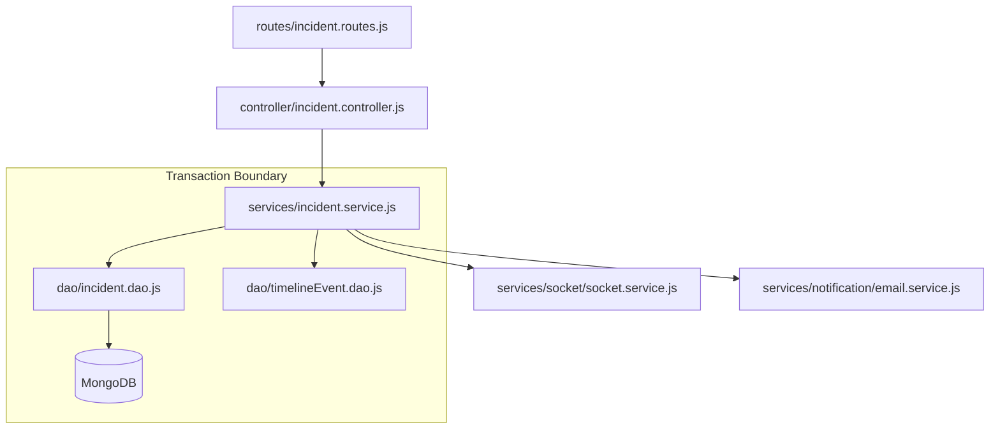

# AlertForge Backend — File & Folder Deep Architecture Guide

Welcome to the AlertForge backend codebase. This guide is designed to onboard new backend engineers by providing a deep, practical breakdown of our file and folder structure. We follow a strict **Layered Architecture** (Controller → Service → DAO → Model) to ensure scalability, maintainability, and testing ease.

---

## 1. Project Root Overview

The root directory sets up the environment, dependencies, and the entry point for the application.

*   `server.js`: The main entry point. It initializes the Express application, connects to the database, sets up global middleware (CORS, body parsing), binds the Socket.IO server, and starts listening on the configured port.
*   `.env`: Stores environment variables (database URIs, secret keys, external API keys). **Never committed to version control.**
*   `package.json` & `package-lock.json`: Manages npm dependencies and defines application scripts (e.g., `npm start`, `npm run dev`).
*   `scratch/`: A temporary directory used for testing isolated scripts or generating one-off data files without polluting the main source tree.

---

## 2. 📂 Folder Structure

The `src/` directory contains all application source code, logically divided by responsibility:

```text
src/
├── config/        # Environment and 3rd-party initializers
├── controller/    # HTTP request/response handlers (Thin Layer)
├── services/      # Business logic and orchestration (The Brain)
├── dao/           # Database query execution (Data Access Layer)
├── model/         # Mongoose schemas and indexes
├── routes/        # API endpoint definitions and middleware mapping
├── middleware/    # Request interceptors (Auth, RBAC, Validation)
├── utils/         # Reusable helper functions and constants
└── validators/    # Zod/Joi schema definitions for request bodies
```

---

## 3. 📂 config/

This layer handles the initialization of external infrastructure and global configurations. It isolates connection logic from the rest of the application.

*   `db.js`: Establishes the connection to MongoDB using Mongoose. Handles connection retries and error logging.
*   `redis.js`: Initializes the Redis client used for caching and Socket.IO Pub/Sub.
*   `socket.js`: Configures the Socket.IO server, binds the Redis adapter for multi-node scaling, and defines the core real-time events (`room:join`, `message:new`).
*   `constants.js`: Houses system-wide static values (HTTP status codes, standard error messages).

**Why this layer exists:** If we switch from Redis to another pub/sub system or change DB providers, we only update files in `config/`.

---

## 4. 📂 controller/ (Thin Layer)

Controllers are the **traffic cops** of the application. They strictly handle incoming HTTP requests, extract parameters, call the appropriate Service layer, and return standard API responses.

### `auth.controller.js`
*   Manages the login and registration flow.
*   Handles secure, HTTP-only cookie attachment and clearing during logout.

### `incident.controller.js`
*   Endpoints for creating, updating, and fetching incidents.
*   Delegates all heavy lifting to `incident.service.js`.

### `warroom.controller.js`
*   Handles REST endpoints for retrieving historical chat messages and toggling task statuses.

**❗ CONTROLLER RULES:**
*   **NO Business Logic:** Controllers must not decide *how* something happens.
*   **NO Direct DAO Calls:** Controllers must never import or call DAO functions. Always route through a Service.

---

## 5. 📂 services/ (CORE LOGIC)

The Service layer is the **"brain"** of the backend. It contains all business rules, cross-module orchestration, side-effect management, and transaction boundaries.

### `incident.service.js`
*   **Lifecycle Logic:** Validates forward-only state transitions.
*   **Transactions:** Uses Mongoose `session.withTransaction()` to guarantee atomic updates.
*   **Side Effects:** After DB commits, it orchestrates Timeline updates, Socket emissions, Status syncing, and triggers AI Postmortems.

### `timeline.service.js`
*   Differentiates between manual responder notes and automated system logs (`autoLogTimelineEvent`).

### `service.service.js`
*   Manages the Service Registry.
*   Contains `syncServiceStatusFromIncidentsService`, which dynamically calculates a service's health based on active incident counts.

### `socket/socket.service.js`
*   Provides clean emitter functions (e.g., `emitWarRoomMessage`, `emitIncidentUpdate`) so other services can broadcast events without needing direct access to the Socket instance.

### `postmortem.service.js`
*   Orchestrates the AI generation pipeline via LangGraph, integrating external Tavily searches with internal DB data.

**✅ SERVICE RESPONSIBILITIES:**
*   Enforce business rules.
*   Orchestrate multi-step flows.
*   Maintain transactional integrity.

---

## 6. 📂 dao/ (Data Access Layer)

DAOs (Data Access Objects) provide a clean abstraction over Mongoose models. They isolate the syntax of the database from the business logic.

### `incident.dao.js`
*   Functions to create, find by ID, update status, and aggregate counts.

### `apikey.dao.js`
*   Handles the secure storage (hashing) and lookup of API keys.

**✅ DAO RULES:**
*   **No Business Logic:** DAOs only execute what the Service tells them to.
*   **No Service Calls:** DAOs cannot call other DAOs or Services (prevents circular dependencies).
*   **Strict Scoping:** Every query **MUST** include `{ organizationId }` to ensure strict multi-tenant isolation.
*   **Performance:** Always append `.lean()` to `find` queries to return plain JS objects instead of heavy Mongoose documents.

---

## 7. 📂 model/ (Schema Layer)

Models define the shape of our data, the validation rules at the DB level, and the indexing strategy for performance.

### `User.model.js`
*   Fields: `email`, `password` (hashed), `role` (admin/responder/viewer).
*   Holds the `organizationId` reference.

### `Incident.model.js`
*   Fields: `status`, `severity`, `serviceName`, `responders`.
*   Indexed by `organizationId` and `createdAt` for fast dashboard queries.

### `Service.model.js`
*   Fields: `uptimePercent`, `status` (operational/degraded/outage).

### `TimelineEvent.model.js`
*   Fields: `type`, `message`, `metadata`, `authorName`.
*   Provides the immutable audit trail for incidents.

### `WarRoomMessage.model.js`
*   Fields: `type` (message/task/file), `isCompleted`, `content`.

**Key Concept:** All operational models share an `organizationId` field to ensure queries never cross organizational boundaries.

---

## 8. 📂 routes/

Routes map HTTP verbs and URLs to specific Controller functions.

*   `incident.routes.js`: Maps `GET /incidents` to `getAllIncidents`.
*   **Middleware Mapping:** This is where `smartAuth` and `requireRole("admin")` are applied before a request reaches the controller.

```javascript
router.post("/", smartAuth, validate(incidentSchema), createIncident);
```

---

## 9. 📂 middleware/

Middleware functions intercept requests to perform checks or modifications before they reach the controller.

### `smartAuth.middleware.js`
*   Checks for a valid Session Cookie OR an `x-api-key` header.
*   Resolves the identity and attaches a normalized `req.user` object (containing `id`, `organizationId`, `role`).

### `rbac.middleware.js`
*   Checks `req.user.role` against required roles to restrict access to sensitive endpoints.

### `error.middleware.js`
*   The global error catcher. Formats exceptions into a standard JSON `ApiResponse` to prevent leaking stack traces to clients.

---

## 10. 📂 utils/

A collection of pure, reusable helper functions that have no state.

*   `ApiError.js`: A custom Error class for throwing HTTP-specific errors.
*   `ApiResponse.js`: Standardizes the shape of successful JSON responses.
*   `timeline.constants.js`: Enums for standardizing timeline event types.

---

## 11. 📂 validators/

Request validation ensures bad data never reaches our business logic.

*   `incident.validator.js`: Uses Zod (or Joi) to ensure a `POST /incidents` body has a valid title, severity, and service name.
*   Validations are run in the route definition using a validator middleware wrapper.

---

## 12. 🔄 Full File Interaction Flow

Understanding how a request traverses these files is crucial:



**The Flow:**
1. Request hits the **Route**.
2. Route applies **Middleware** (Auth/Validation).
3. **Controller** unpacks the request and calls the **Service**.
4. **Service** applies business rules, opens a transaction, and calls the **DAO**.
5. **DAO** modifies the **DB** via the **Model**.
6. **Service** fires off background side-effects (Sockets, Emails).
7. **Controller** returns the result to the client.

---

## 13. 🧠 Where to Add New Features (Developer Guide)

When building a new feature (e.g., "Maintenance Windows"), follow this exact sequence:

1.  **Define Model:** Create `Maintenance.model.js` with `organizationId`.
2.  **Add DAOs:** Create `maintenance.dao.js` for DB queries.
3.  **Add Service Logic:** Create `maintenance.service.js` for orchestration and business rules.
4.  **Add Validation:** Create `maintenance.validator.js`.
5.  **Create Controller:** Create `maintenance.controller.js` to map request/response.
6.  **Expose Routes:** Create `maintenance.routes.js` and register it in `server.js`.
7.  **Wire Side Effects:** Add Socket or Timeline hooks in the service if needed.

---

## 14. 🚨 Common Mistakes to Avoid

*   ❌ **Putting business logic in the Controller**: Controllers should be dumb. If you have `if/else` logic checking status transitions in a controller, move it to a service.
*   ❌ **Skipping `organizationId` in DAOs**: Always filter by `organizationId` to prevent massive security breaches.
*   ❌ **Direct DB calls from Service**: Do not use `Model.find()` in a service. Call a DAO.
*   ❌ **No transaction for critical updates**: If a flow touches two collections (e.g., Incident + Timeline), it MUST use `session.withTransaction()`.

---

## 15. 📌 Summary

This layered architecture provides three critical benefits:
1.  **Scalability**: We can swap out MongoDB for PostgreSQL by only rewriting the DAO layer.
2.  **Testability**: We can easily mock DAOs to unit test complex Service logic.
3.  **Safety**: Centralized DAOs ensure security scoping (`organizationId`) is never accidentally bypassed by a rogue query.

Welcome to the team. You are now ready to build on AlertForge.
