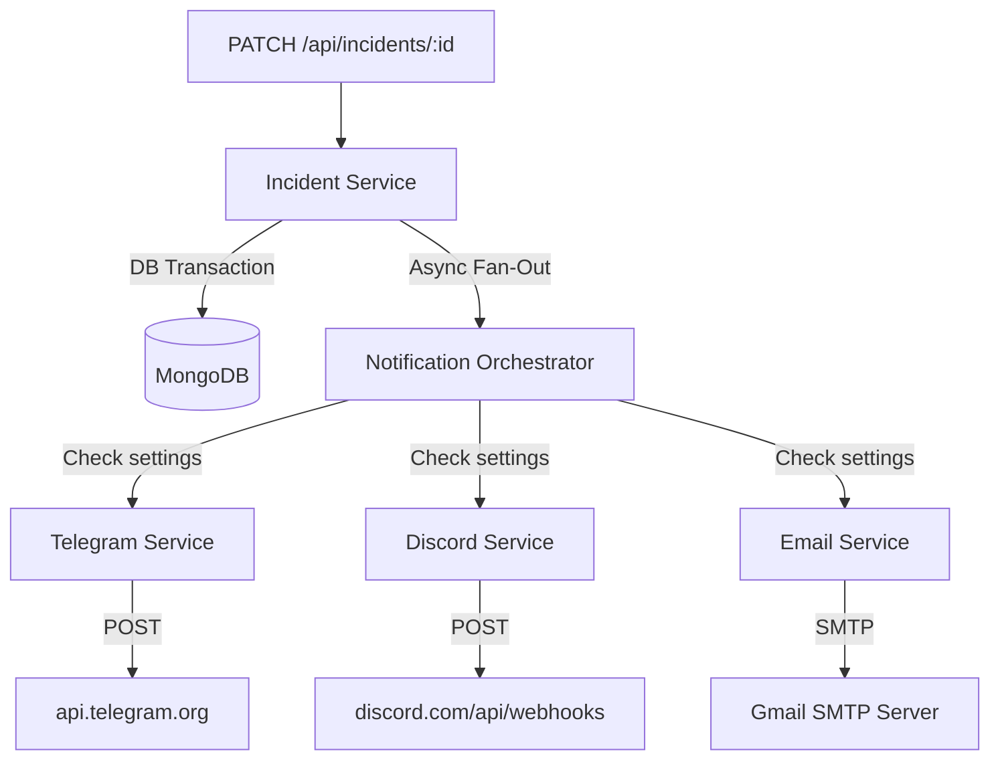

# 🚀 AlertForge: Multi-Channel Notification System Architecture

This document explains exactly how AlertForge dispatches real-time alerts to external platforms (Telegram, Discord, and Email) without slowing down the core API.

---

## 🔄 1. The High-Level Flow (How it gets triggered)

When an incident is created, status changed, or severity upgraded, the system follows a strict **post-commit side-effect** pattern:

1. **Incident Controller** receives request.
2. **Incident Service** validates and writes to MongoDB using a transaction.
3. Once the DB commit is successful, the service triggers `sendIncidentNotification({ incident, user, type })` **asynchronously**.
4. The **Notification Orchestrator** reads the user's `notificationSettings`.
5. It fans out the requests concurrently using `Promise.allSettled()` to Telegram, Discord, and Email.



---

## 🎯 2. Triggers: Which Routes Fire Notifications?

The system does not send notifications randomly. It strictly listens to three specific Incident API endpoints.

To trigger a notification, you must authenticate using **either** of these credentials:
1. **Dashboard Session Cookie**: `accessToken` (Automatically attached if logged into the dashboard).
2. **API Key**: `x-api-key: <your_raw_api_key>` (Passed in the headers).

When authenticated, hitting any of the following routes will trigger the notification fan-out:

### A. Creating an Incident
* **Route:** `POST /api/incidents`
* **Triggered Type:** `"INCIDENT_CREATED"`
* **Payload Example:** `{ "title": "DB Down", "service": "payments", "severity": "P1" }`
* **Result:** Alerts all channels with a "🚨 New Incident Alert" title.

### B. Updating Incident Status
* **Route:** `PATCH /api/incidents/:id/status`
* **Triggered Type:** `"STATUS_UPDATED"`
* **Payload Example:** `{ "status": "Identified" }`
* **Result:** Alerts all channels with a "🔄 Incident Status Update" title.

### C. Updating Incident Severity
* **Route:** `PATCH /api/incidents/:id/severity`
* **Triggered Type:** `"SEVERITY_UPDATED"`
* **Payload Example:** `{ "severity": "P1" }`
* **Result:** Alerts all channels with an "⚠️ Incident Severity Update" title.

---

## 💬 3. How Telegram Works

We use the official **Telegram Bot API**.

* **The API Used:** `POST https://api.telegram.org/bot<TOKEN>/sendMessage`
* **Configuration:**
  * Requires a Bot Token (`TELEGRAM_BOT_TOKEN` in `.env`) created via BotFather.
  * The user provides their `telegramChatId` in their AlertForge profile. This can be a personal chat ID or a Group Chat ID where the bot is added.
* **The Code:** `src/services/notification/telegram.service.js`
* **Execution:** We send a `Markdown` formatted message containing the Incident Title, Service, Severity, Status, and a direct link to the War Room.

---

## 🎮 4. How Discord Works

We use **Discord Webhooks**, which do not require a bot token or complex authentication.

* **The API Used:** `POST https://discord.com/api/webhooks/<WEBHOOK_ID>/<TOKEN>`
* **Configuration:**
  * The user generates a webhook URL from their Discord Server Settings -> Integrations.
  * They save this URL (`discordWebhookUrl`) in their AlertForge profile.
* **The Code:** `src/services/notification/webhook.service.js`
* **Execution:** We send a structured Discord **Embed** payload (`application/json`). The embed color automatically changes based on the event type (Red for New Incident, Green for Status Updates, Orange for Severity).

---

## 📧 5. How Email Works

We use **Nodemailer** to dispatch HTML-formatted emails.

* **The API Used:** Standard SMTP over TLS (Currently configured for Gmail).
* **Configuration:**
  * Requires `EMAIL_USER` and `EMAIL_PASS` (App Password) in `.env`.
  * The user provides an array of `teamEmails` in their AlertForge profile.
* **The Code:** `src/services/notification/email.service.js`
* **Execution:** The service iterates over the unique set of emails and dispatches a branded HTML email containing the incident details.

---

## ⚙️ 6. The Proper Way to Configure It (User Profile)

For these notifications to fire, the user must configure their profile properly via the newly hardened **User Model**.

### The Endpoint
`PATCH /api/users/profile`

### The Required Payload Structure
```json
{
  "teamEmails": ["engineering@company.com", "oncall@company.com"],
  "telegramChatId": "-100123456789",
  "discordWebhookUrl": "https://discord.com/api/webhooks/...",
  "notificationSettings": {
    "emailEnabled": true,
    "telegramEnabled": true,
    "discordEnabled": true
  }
}
```

### The Safety Checks (Service Layer Validations)
1. **Email Regex:** Mongoose actively validates that every string in `teamEmails` is a valid email format.
2. **Discord URL Validation:** Mongoose blocks any Discord URL that does not explicitly start with `https://discord.com/api/webhooks/`.
3. **Toggle Logic:** If a user sends `"telegramEnabled": true`, the backend strictly verifies that a `telegramChatId` exists (either sent in the same request or previously saved in the database).

---

## 🛡️ 7. Why This Architecture is Production-Ready

1. **Non-Blocking:** By using `Promise.allSettled()`, sending notifications does not delay the HTTP response sent back to the client.
2. **Fault-Tolerant:** If the Telegram API goes down, it will reject its specific Promise, but the Discord and Email promises will still execute successfully. One broken channel does not break the others.
3. **Thin Controllers:** The Incident Controller doesn't even know notifications exist. All side-effects are cleanly tucked away inside the Service Layer.
