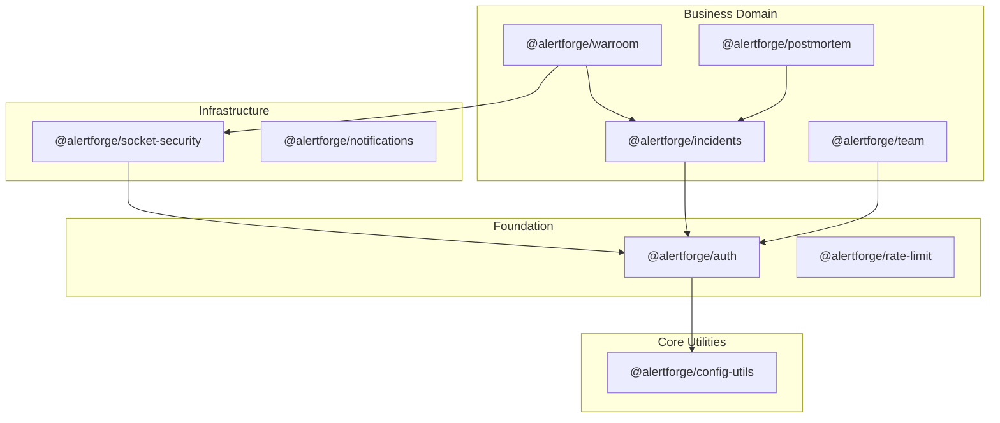

# AlertForge NPM Package Architecture Plan

**Author:** Senior Backend Architect  
**Status:** Strategic Design Phase  
**Version:** 1.0.0

---

## 1. SYSTEM OVERVIEW

### Why Modular Packages?
As AlertForge scales from a single monolithic dashboard to a platform (SDKs, CLI, custom internal dashboards), core business logic must be decoupled from the Express.js implementation details. 
Moving to an **NPM-first modular architecture** allows:
- **Consistency:** The same RBAC and isolation logic used in the dashboard is used in the CLI.
- **Velocity:** Independent teams can work on the `@alertforge/postmortem` AI pipeline without touching `@alertforge/auth`.
- **Extensibility:** Third-party partners can use `@alertforge/notifications` to build custom notification sinks.

### Architecture Diagram (Package Dependencies)



---

## 2. PACKAGE LIST

| Package | Purpose | Primary Dependencies |
|---|---|---|
| `@alertforge/auth` | Multi-tenant auth (JWT + API Key) & RBAC | `jsonwebtoken`, `bcryptjs` |
| `@alertforge/rate-limit` | Distributed throttling for API & Sockets | `redis`, `express-rate-limit` |
| `@alertforge/socket-security` | Handshake validation & Scoped room access | `socket.io`, `@alertforge/auth` |
| `@alertforge/incidents` | Core incident state machine & timeline | `mongoose`, `@alertforge/auth` |
| `@alertforge/warroom` | Real-time collaboration engine | `@alertforge/incidents` |
| `@alertforge/notifications` | Modular fan-out (Telegram, Discord, etc) | `axios`, `nodemailer` |
| `@alertforge/postmortem` | AI-driven analysis & Export engine | `langchain`, `tavily` |

---

## 3. PACKAGE INTERNAL DESIGN

### 🛡️ @alertforge/auth
**Purpose:** Handles identity verification and role-based access control.

- **Exports:**
  - `smartAuth(secret)`: Middleware handling both Cookie/JWT and `x-api-key`.
  - `rbac(requiredRole)`: Middleware to guard routes.
  - `tokenService.create(payload)`: Utility to sign access/refresh tokens.
  - `organizationGuard()`: Ensures all DB queries are scoped to the authenticated `organizationId`.
- **Usage Example:**
  ```javascript
  import { smartAuth, rbac } from "@alertforge/auth";
  app.use("/api/protected", smartAuth(process.env.JWT_SECRET), rbac("responder"));
  ```

### ⚡ @alertforge/rate-limit
**Purpose:** Protects infrastructure from flooding at the IP and API Key level.

- **Exports:**
  - `apiLimiter(config)`: Express middleware for Rest APIs.
  - `socketLimiter(socket, config)`: Logic for Socket.io event throttling.
  - `headers.retryAfter(res, ms)`: Standardized header injection.
- **Config:** Supports `windowMs`, `max`, and Redis `store` connection.

### 🔌 @alertforge/socket-security
**Purpose:** Hardens the Socket.io handshake and event pipeline.

- **Exports:**
  - `socketAuth(apiKeyService)`: Handshake middleware.
  - `roomGuard(incidentId)`: Validates if a user has a "War Room Access Token" for a specific incident.
  - `presenceTracker(io)`: Standardized logic for room counting and member presence events.

### 🚨 @alertforge/incidents
**Purpose:** Encapsulates the incident lifecycle and automated logging.

- **Exports:**
  - `incidentService.create(data)`: Logic including status sync and timeline initialization.
  - `timelineLogger.log(incidentId, type, text)`: Standardized event logging.
  - `IncidentSchema`: Reusable Mongoose schema definitions.

### 📬 @alertforge/notifications
**Purpose:** Multi-channel alert dispatching with retry logic.

- **Exports:**
  - `NotificationHub`: Class to register and trigger channels.
  - `channels`: `TelegramChannel`, `DiscordChannel`, `EmailChannel`.
  - `broadcast(event, payload)`: Unified entry point for fan-out.
- **Env Vars:** `TELEGRAM_BOT_TOKEN`, `SMTP_HOST`, etc.

---

## 4. INTEGRATION FLOW

A new service (e.g., *AlertForge Collector*) would integrate as follows:

1.  **Install:** `npm install @alertforge/auth @alertforge/rate-limit @alertforge/incidents`
2.  **Configure:**
    ```javascript
    import { initializeAuth } from "@alertforge/auth";
    initializeAuth({ secret: process.env.JWT_SECRET, apiKeys: apiKeyDAO });
    ```
3.  **Mount Middleware:**
    ```javascript
    app.post("/report", apiLimiter("heavy"), smartAuth, (req, res) => {
        // Logic...
    });
    ```
4.  **Consume Services:** Use `incidentService.create` to ensure the timeline and notifications trigger automatically.

---

## 5. MIGRATION STRATEGY

1.  **Phase 1: Core Foundation** (Week 1)
    - Extract `@alertforge/auth` and `@alertforge/rate-limit`.
    - Replace local middleware in the main backend with these packages.
2.  **Phase 2: Real-time & Events** (Week 2)
    - Extract `@alertforge/socket-security` and `@alertforge/notifications`.
    - Decouple the Telegram/Discord logic into independent modules.
3.  **Phase 3: Domain Extraction** (Week 3)
    - Extract `@alertforge/incidents` and `@alertforge/postmortem`.
    - Move Mongoose models into shared package logic.
4.  **Phase 4: Cleanup & Documentation** (Week 4)
    - Final audit of peer dependencies to ensure no circular references.

---

## 6. FINAL BENEFITS

- **Atomic Testing:** Each package can have its own Jest suite, improving overall system reliability.
- **Technology Agnostic (Partially):** While most use Mongoose, the `@alertforge/auth` logic can be ported to other frameworks easily.
- **Reduced Bloat:** Microservices only install the packages they need (e.g., a "Notification Worker" only needs `@alertforge/notifications`).

**Conclusion:** This architecture transforms AlertForge from a project into a **toolkit**, enabling rapid development of future incident response tools while maintaining a strict security posture.
