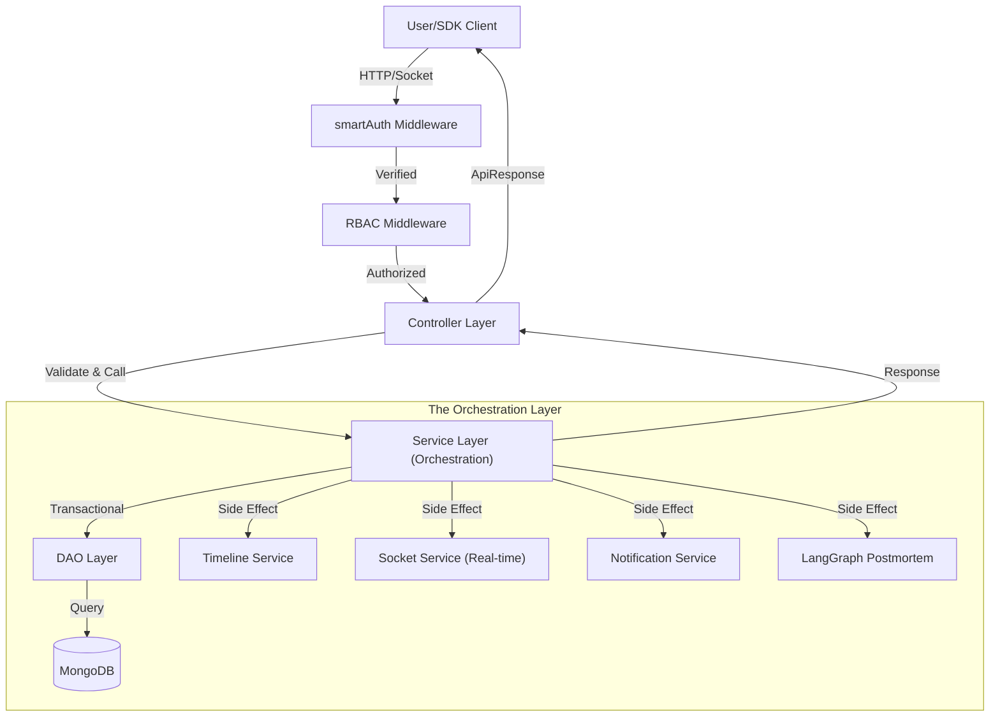

<div align="center">

# 🛡️ AlertForge
### **Forge Resilience. Automate Response. Resolve Faster.**

[](https://github.com/Soumipal56/AlertForge)
[](https://github.com/Soumipal56/AlertForge)
[](https://github.com/Soumipal56/AlertForge)

---

**AlertForge** is a production-grade incident management and response orchestration platform. Designed for modern engineering teams, it bridges the gap between infrastructure monitoring and actionable resolution. With AI-driven postmortems, real-time collaboration "War Rooms," and multi-channel notifications, AlertForge ensures your team spends less time panic-searching and more time resolving.


</div>

---

## 🚀 Key Features

### 🧠 **AI-Powered Postmortems (LangGraph)**
Stop writing post-incident reports manually. AlertForge uses a state-of-the-art **LangGraph pipeline** to ingest incident timelines, chat logs, and external technical insights to generate high-fidelity, hallucination-free postmortems automatically upon resolution.

### ⚔️ **Real-time "War Rooms"**
Collaborate in live, purpose-built environments. Features include:
- **Live Chat & Task Checklists**: Synchronized across all responders via Socket.IO.
- **Presence Tracking**: See exactly who is investigating in real-time.
- **Auto-Timeline**: Every action is automatically logged to the immutable audit trail.

### 📡 **Multi-Channel Alert Orchestration**
Never miss a critical pulse. Route alerts dynamically to:
- **Telegram** & **Discord** Webhooks.
- **WhatsApp** (via Twilio).
- **Email** (SMTP/Nodemailer).
- **Custom Webhooks** for external integrations.

### 🏢 **Enterprise-Ready Multi-Tenancy**
Strict organization-level data isolation. Manage multiple teams, services, and environments under one unified dashboard with robust Role-Based Access Control (RBAC).

### 📊 **Service Health Registry**
A unified catalog of your infrastructure. Monitor uptime percentages and see the cascading impact of incidents on downstream services in real-time.

---

## 🛠️ Tech Stack

### **Frontend**
- **Core**: React 19 + Vite (Ultra-fast HMR)
- **Styling**: Tailwind CSS 4 + Shadcn UI
- **Animations**: Framer Motion + GSAP (For a premium, interactive UI)
- **Auth**: Clerk (Secure User Management)
- **State/Data**: Axios + Socket.io-client

### **Backend**
- **Server**: Node.js + Express 5
- **Database**: MongoDB (Mongoose) + Redis (ioredis)
- **Real-time**: Socket.IO with Redis Adapter (Horizontally scalable)
- **AI/ML**: LangChain + LangGraph + Mistral AI
- **Queues**: BullMQ for resilient background processing

---

## 🏗️ System Architecture

AlertForge follows a strictly **Layered Architecture** to ensure maintainability and production resilience.



---

## 🚦 Getting Started

### **Prerequisites**
- Node.js (v18+)
- MongoDB Instance
- Redis Instance (Upstash recommended)
- API Keys: Mistral AI, Twilio, Clerk, Tavily

### **Installation**

1. **Clone the Repository**
   ```bash
   git clone https://github.com/Soumipal56/AlertForge.git
   cd AlertForge/AlertForge/AlertForge
   ```

2. **Setup Backend**
   ```bash
   cd Backend
   npm install
   cp .env.example .env # Update your variables
   npm run dev
   ```

3. **Setup Frontend**
   ```bash
   cd ../Frontend
   npm install
   cp .env.example .env # Update your variables
   npm run dev
   ```

---

## 🛡️ Security & Performance
- **Dual-Mode Auth**: Seamlessly switch between Dashboard (Cookie) and SDK (API Key) auth.
- **Distributed Blacklisting**: Redis-backed JWT invalidation for instant session termination.
- **Database Indexing**: Optimized compound indexes for O(1) dashboard aggregations.
- **Atomic Operations**: MongoDB transactions ensure data integrity across incidents and timelines.

---

## 📄 License
Distributed under the ISC License. See `LICENSE` for more information.

---

<div align="center">
Built with ❤️ for the Hackathon by <b>Team CodeBlooded</b>
<br/>
<i>"Forging the future of SRE tools."</i>
</div>
